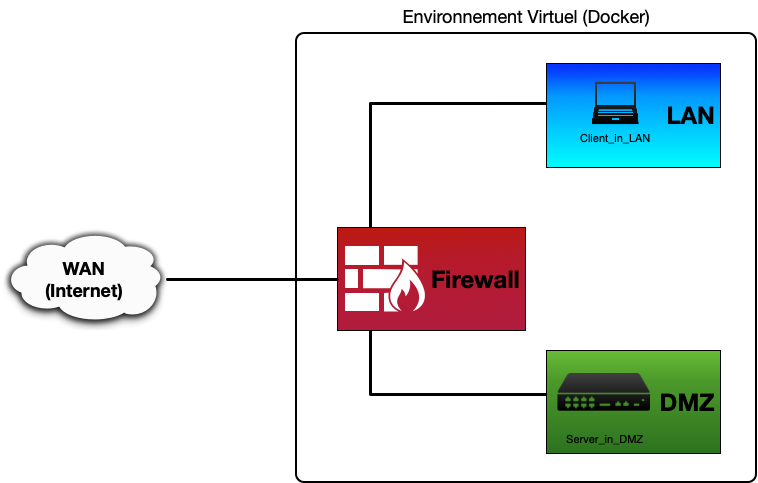
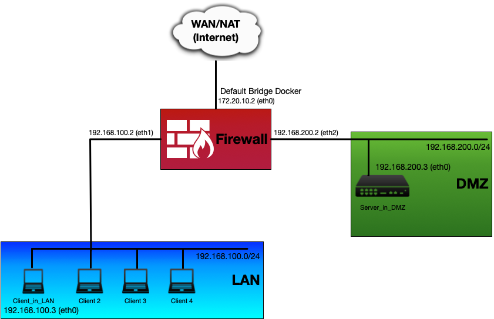
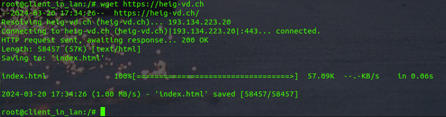
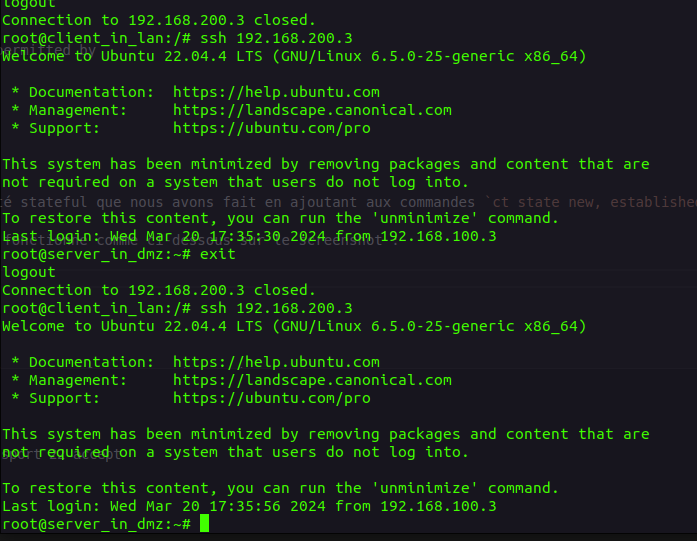
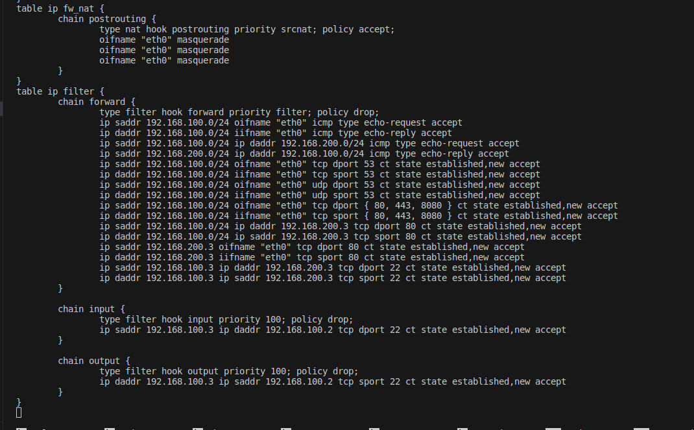

[](https://classroom.github.com/a/qqWUWp73)
[](https://classroom.github.com/online_ide?assignment_repo_id=14203397&assignment_repo_type=AssignmentRepo)
# HEIGVD - Sécurité des Réseaux - 2024
# Laboratoire n°2 - Firewall

**Travail à réaliser en équipes de deux personnes.**

Vous pouvez répondre aux questions en modifiant directement votre clone du README.md ou avec un fichier pdf que vous pourrez uploader sur votre fork.

Le rendu consiste simplement à compléter toutes les parties marquées avec la mention "LIVRABLE". Le rendu doit se faire par un `git commit` sur la branche `main`.

## Table de matières

[Introduction](#introduction)

[Echéance](#echéance)

[Topologie](#topologie)

[Adressage](#plan-dadressage)

[Cahier des charges du réseau](#cahier-des-charges-du-réseau)

[Regles de filtrage](#regles-de-filtrage)

[Installation de l’environnement virtualisé](#installation-de-lenvironnement-virtualisé)

[Tests des connections et exemple de l'application d'une règle](#tests-des-connections-et-exemple-de-lapplication-dune-règle)

[Règles pour le protocole DNS](#règles-pour-le-protocole-dns)

[Règles pour les protocoles HTTP et HTTPS](#règles-pour-les-protocoles-http-et-https)

[Règles pour le protocole ssh](#règles-pour-le-protocole-ssh)

[Règles finales](#règles-finales)

# Introduction

L’objectif principal de ce laboratoire est de familiariser les étudiants avec les pares-feu et en particulier avec `netfilter` et `nftables`, le successeur du vénérable `iptables`.
En premier, une partie théorique permet d’approfondir la rédaction de règles de filtrage.

Par la suite, la mise en pratique d’un pare-feu permettra d’approfondir la configuration et l’utilisation d’un pare-feu ainsi que la compréhension des règles.

La [documentation nftables](https://wiki.nftables.org/wiki-nftables/index.php/Main_Page) est très complète. Vous en aurez besoin pour réaliser ce laboratoire et pour répondre à certaines questions.

La documentation contient aussi un excellent résumé pour "[apprendre nftables en 10 minutes](https://wiki.nftables.org/wiki-nftables/index.php/Quick_reference-nftables_in_10_minutes)" qui peut vous être utile.

## Auteurs

Ce texte se réfère au laboratoire « Pare-feu » à suivre dans le cadre du cours Sécurité des Réseaux, 2024, version 10.0.  Au cours du temps, il a été rédigé, modifié et amélioré par les co-auteurs suivants : Gilles-Etienne Vallat, Alexandre Délez, Olivia Manz, Patrick Mast, Christian Buchs, Sylvain Pasini, Vincent Pezzi, Yohan Martini, Ioana Carlson, Abraham Rubinstein, Frédéric Saam, Linus Gasser et Lucas Gianinetti.

## Echéance

Ce travail devra être rendu le mercredi après la fin de la 2ème séance de laboratoire, soit au plus tard, **le mercredi, 20 Mars 2024, à 23h59.**

# Réseaux cible

## Topologie

Durant ce laboratoire, nous allons utiliser une seule topologie réseau :



Notre réseau local (LAN) sera connecté à Internet (WAN) à travers d’un pare-feu. Nous placerons un serveur Web en zone démilitarisée (DMZ).

Par conséquent, nous distinguons clairement trois sous-réseaux :

- Internet (WAN), le réseau de l'école ou votre propre réseau servira de WAN,
- le réseau local (LAN),
- la zone démilitarisée (DMZ).

Ce réseau sera créé de manière virtuelle. Il sera simulé sur un seul ordinateur utilisant trois conteneurs Docker basés sur le système d’exploitation Ubuntu :

- La première machine, Firewall, fait office de pare-feu. Elle comporte trois interfaces réseaux. Afin que ce poste puisse servir de pare-feu dans notre réseau, nftables sera utilisé.
- La seconde machine, Client\_In\_LAN, fait office de client dans le réseau local (LAN).
- La dernière machine, Server\_In\_DMZ, fait office de serveur Web en (DMZ).

Nous allons utiliser les trois interfaces réseaux de la machine Firewall afin de pouvoir connecter le LAN et la DMZ à Internet (WAN). Les machines Client\_In\_LAN et Server\_In\_DMZ comportent chacune une interfaces réseau eth0.

## Plan d'adressage

Afin de bien spécifier le réseau, il est nécessaire d’avoir un plan d'adressage précis. C'est la liste des réseaux que vous utiliserez, comprenant pour chaque interface l'adresse IP ainsi que le masque de sous-réseau.
Pour ce laboratoire, nous vous imposons le plan d’adressage suivant :

- Le réseau "LAN" &rarr; 192.168.100.0/24
- Le réseau "DMZ" &rarr; 192.168.200.0/24
- Le réseau "WAN" sera défini par le NAT interne du réseau Docker

Les adresses IP sont définies dans le schéma ci-dessous :



## Cahier des charges du réseau

Avant de configurer les règles, il est primordial de connaître les besoins de notre réseau. Ceci afin de laisser passer les flux légitimes lors de la rédaction des règles.

Le but du **LAN** est de fournir aux utilisateurs de votre réseau un accès à Internet ; à certains services de base uniquement en empêchant les connexions provenant de l'extérieur. Il faudra tout de même laisser entrer les paquets répondants aux requêtes de notre LAN. Une seule machine est présente sur ce réseau. Il s’agit de la machine dont le nom est **Client\_In\_LAN**. (il est très facile de rajouter de machines supplémentaires sur le LAN utilisant Docker).

La **DMZ** est un réseau réservé aux serveurs que l'on veut rendre accessibles depuis l'extérieur et l’intérieur de notre réseau. Par exemple, si nous voulons publier un site web que l'on héberge, il faut accepter des connexions sur le serveur web; dans ce cas, nous ne pouvons pas le placer dans le LAN, cela constituerait un risque. Nous accepterons donc les connexions entrantes dans la DMZ, mais seulement pour les services que l'on désire offrir. Le serveur Web situé dans la DMZ est simulé par la machine **Server\_In\_DMZ**.

Le **WAN** n'est que l'accès à Internet. Il est connecté au réseau de l'école ou à votre propre à travers le système de réseau fourni par Docker.

Pour établir la table de filtrage, voici les **conditions à respecter** dans le cadre de ce laboratoire :

1.	Les **serveurs DNS** utilisés par les postes dans le LAN sont situés sur le WAN. Les services DNS utilisent les ports UDP 53 et TCP 53.
2.	Laisser passer les **PING** uniquement du LAN au WAN et du LAN à la DMZ. La DMZ ne doit pas pouvoir contacter le LAN. Le ping utilise le protocole ICMP (echo request et echo reply).
3.	Les clients du **LAN** doivent pouvoir ouvrir des connexions HTTP pour accéder au web. Le protocole HTTP utilise les ports TCP 80 et typiquement aussi le 8080.
4.	Les clients du **LAN** doivent pouvoir ouvrir des connexions HTTPS pour accéder au web. Le protocole HTTPS utilise le port TCP 443.
5.	Le serveur **web en DMZ** doit être atteignable par le WAN et le LAN et n'utilise que le port 80.
6.	Le serveur de la DMZ peut être commandé à distance par **ssh** depuis votre client du LAN **uniquement**. Le service ssh utilise le port TCP 22.
7.	Le firewall peut être configuré à distance par **ssh** depuis votre client du LAN **uniquement**.
8.	**Toute autre action est par défaut interdite**.

# Regles de filtrage

a) En suivant la méthodologie vue en classe, établir la table de filtrage avec précision en spécifiant la source et la destination, le type de trafic (TCP/UDP/ICMP/any), les ports sources et destinations ainsi que l'action désirée (<b>Accept</b> ou <b>Drop</b>, éventuellement <b>Reject</b>).
  Pour cette partie, écrivez les règles en prenant en compte que vous allez mettre en place un Firewall <b>stateless</b>.

_Pour l'autorisation d'accès (**Accept**), il s'agit d'être le plus précis possible lors de la définition de la source et la destination : si l'accès ne concerne qu'une seule machine (ou un groupe), il faut préciser son adresse IP ou son nom (si vous ne pouvez pas encore la déterminer), et non la zone.
Appliquer le principe inverse (être le plus large possible) lorsqu'il faut refuser (**Drop**) une connexion._

_Lors de la définition d'une zone, spécifier l'adresse du sous-réseau IP avec son masque (par exemple, "/24" correspond à 255.255.255.0) ou l'interface réseau (par exemple : "interface WAN") si l'adresse du sous-réseau ne peut pas être déterminée avec précision._

---

**LIVRABLE : Remplir le tableau**

|       Adresse IP source        |     Adresse IP destination     |         Type          |    Port src     |  Port dst   | Action |
| :----------------------------: | :----------------------------: | :-------------------: | :-------------: | :---------: | :----: |
|     192.168.100.0/24 (LAN)     |    172.20.10.2 (WAN, eth0)     |       TCP / UDP       |       ANY       |     53      | ACCEPT |
|    172.20.10.2 (WAN, eth0)     |    172.20.10.2 (WAN, eth0)     |       TCP / UDP       |       53        |     ANY     | ACCEPT |
|    172.20.10.2 (WAN, eth0)     |     192.168.100.0/24 (LAN)     |  ICMP 0 (echo reply)  |        -        |      -      | ACCEPT |
|     192.168.200.0/24 (DMZ)     |     192.168.100.0/24 (LAN)     |  ICMP 0 (echo reply)  |        -        |      -      | ACCEPT |
|     192.168.100.0/24 (LAN)     |    172.20.10.2 (WAN, eth0)     | ICMP 8 (echo request) |        -        |      -      | ACCEPT |
|     192.168.100.0/24 (LAN)     |     192.168.200.0/24 (DMZ)     | ICMP 8 (echo request) |        -        |      -      | ACCEPT |
|     192.168.100.0/24 (LAN)     |    172.20.10.2 (WAN, eth0)     |          TCP          |       ANY       | 80/8080/443 | ACCEPT |
|    172.20.10.2 (WAN, eth0)     |     192.168.100.0/24 (LAN)     |          TCP          | 80 / 8080 / 443 |     ANY     | ACCEPT |
|     192.168.100.0/24 (LAN)     |     192.168.200.0/24 (DMZ)     |          TCP          |       ANY       |     80      | ACCEPT |
|    172.20.10.2 (WAN, eth0)     |     192.168.200.0/24 (DMZ)     |          TCP          |       ANY       |     80      | ACCEPT |
|     192.168.200.0/24 (DMZ)     |     192.168.100.0/24 (LAN)     |          TCP          |       80        |     ANY     | ACCEPT |
|     192.168.200.0/24 (DMZ)     |    172.20.10.2 (WAN, eth0)     |          TCP          |       80        |     ANY     | ACCEPT |
|     192.168.100.0/24 (LAN)     |     192.168.200.0/24 (DMZ)     |          TCP          |       ANY       |     22      | ACCEPT |
|     192.168.200.0/24 (DMZ)     |     192.168.100.0/24 (LAN)     |          TCP          |       22        |     ANY     | ACCEPT |
|     192.168.100.0/24 (LAN)     | 192.168.100.2 (firewall, eth1) |          TCP          |       ANY       |     22      | ACCEPT |
| 192.168.100.2 (firewall, eth1) |     192.168.100.0/24 (LAN)     |          TCP          |       22        |     ANY     | ACCEPT |
|              ANY               |              ANY               |          ANY          |       ANY       |     ANY     |  DROP  |

---

# Installation de l’environnement virtualisé

Ce chapitre indique comment installer l'environnement. Il se base sur des outils gratuits, téléchargeables sur Internet.

## Matériel
Il est possible d’utiliser les mêmes instructions sur une version de Windows ou un système Linux ou Mac OS X.

Afin d'installer les différents logiciels présentés ici, il faut disposer d’un ordinateur (avec les droits administrateur).

## Installation de Docker
Docker est un logiciel permettant de créer des conteneurs virtuels afin de simuler diverses configurations. Nous l'utiliserons pour exécuter les trois machines dont nous aurons besoin pour ce laboratoire. L’installation de Docker ne comporte pas de difficulté particulière. Une installation « par défaut » suffira. Il est possible d’utiliser une version que vous avez déjà installée ou une version téléchargée, mais la documentation pour ce laboratoire a été testée avec la version 3.2.2 de Docker Desktop pour Mac. Si vous rencontrez des problèmes, une mise à jour de Docker es peut-être la solution.

Vous pouvez trouver Docker pour Windows et Mac OS [ici](https://www.docker.com/products/docker-desktop).

Pour Linux, referez-vous au gestionnaire de paquets de votre distribution.

## Installation de Git

Vous avez probablement déjà installé Git pour d’autres cours ou projets. Si ce n’est pas le cas, vous pouvez prendre la bonne version pour votre OS [ici](https://git-scm.com/download/).


## Démarrage de l'environnement virtuel

### Ce laboratoire utilise docker-compose, un outil pour la gestion d'applications utilisant multiples conteneurs. Il va se charger de créer les réseaux `lan` et `dmz`, la machine Firewall, un serveur dans le réseau DMZ et une machine dans le réseau LAN et de tout interconnecter correctement.

Nous allons commencer par lancer docker-compose. Il suffit de taper la commande suivante dans le répertoire racine du labo (celui qui contient le fichier `docker-compose.yml`:

```bash
docker-compose up --detach
```
Pour linux...
Si il y à un erreur pour le Network 0wan alors il faut faire les étapes suivantes (toujours en sudo) :

```
sudo docker network prune
sudo docker network ls // pour voir les réseaux
```

Le téléchargement et génération d'images prend peu de temps.

Vous pouvez vérifier que les réseaux ont été créés avec la commande `docker network ls`. Un réseau `lan` et un réseau `dmz` devraient se trouver dans la liste. Lors de la création d'un network, docker utilise l'adresse *x.x.x.1* comme gateway entre l'hôte et le network correspondant. C'est pourquoi vous verrez que les adresses IP des interfaces réseau de la machine *firewall* sont en *x.x.x.2*. Vous trouverez les interfaces réseau virtuelles créées par docker pour communiquer avec les différents réseau en utilisant la command *ip address*; les interfaces en question se nomment *br-NETWORK ID*.

Les images utilisées pour les conteneurs sont basées sur l'image officielle Ubuntu. Le fichier `Dockerfile` que vous avez téléchargé contient les informations nécessaires pour la génération de l'image de base. `docker-compose` l'utilise comme un modèle pour générer les conteneurs. Vous pouvez vérifier que les trois conteneurs sont crées et qu'ils fonctionnent à l'aide de la commande suivante:

```bash
docker-compose ps
```

Pour que ça marche, vous devez être dans le répertoire où se trouve le docker-compose.yaml.

## Communication avec les conteneurs et configuration du firewall

Afin de simplifier vos manipulations, les conteneurs ont été configurées avec les noms suivants :

- firewall
- client\_in\_lan
- server\_in\_dmz

Pour accéder au terminal de l’une des machines, il suffit de taper :

```bash
docker-compose exec <nom_de_la_machine> /bin/bash
```
ou pour une installation docker plus moderne:
```bash
docker compose exec <nom_de_la_machine> /bin/bash
```

Par exemple, pour ouvrir un terminal sur votre firewall :

```bash
docker-compose exec firewall /bin/bash
```
ou pour une installation docker plus moderne:
```bash
docker compose exec firewall /bin/bash
```

Vous pouvez bien évidemment lancer des terminaux avec les trois machines en même temps, ou utiliser 
le "Docker Desktop" pour lancer les terminaux.


## Configuration de base

La plupart de paramètres sont déjà configurés correctement sur les trois machines. Il est pourtant nécessaire de rajouter quelques commandes afin de configurer correctement le réseau pour le labo.

Vous pouvez commencer par vérifier que le ping n'est pas possible actuellement entre les machines. Depuis votre Client\_in\_LAN, essayez de faire un ping sur le Server\_in\_DMZ (cela ne devrait pas fonctionner !) :

```bash
ping 192.168.200.3
```
---

**LIVRABLE : copié/collé de votre tentative de ping.**  

```
root@client_in_lan:/# ping 192.168.200.3
PING 192.168.200.3 (192.168.200.3) 56(84) bytes of data.
^C
--- 192.168.200.3 ping statistics ---
5 packets transmitted, 0 received, 100% packet loss, time 4082ms

root@client_in_lan:/# 
```

---

En effet, la communication entre les clients dans le LAN et les serveurs dans la DMZ doit passer à travers le Firewall. Dans certaines configurations, il est probable que le ping arrive à passer par le bridge par défaut. Ceci est une limitation de Docker. **Si votre ping passe**, vous pouvez accompagner votre capture du ping avec une capture d'une commande traceroute qui montre que le ping ne passe pas actuellement par le Firewall mais qu'il a emprunté un autre chemin.

Il faut donc définir le Firewall comme passerelle par défaut pour le client dans le LAN et le serveur dans la DMZ.

### Configuration du client LAN

Dans un terminal de votre client, taper les commandes suivantes :

```bash
ip route del default
ip route add default via 192.168.100.2
```

### Configuration du serveur dans la DMZ

Dans un terminal de votre serveur dans DMZ, taper les commandes suivantes :

```bash
ip route del default
ip route add default via 192.168.200.2

service nginx start
service ssh start
```

Les deux dernières commandes démarrent les services Web et SSH du serveur.

La communication devrait maintenant être possible entre les deux machines à travers le Firewall. Faites un nouveau test de ping, cette fois-ci depuis le serveur vers le client :

```bash
ping 192.168.100.3
```

---

**LIVRABLES : copié/collé des routes des deux machines et de votre nouvelle tentative de ping.**

```
root@server_in_dmz:/# ping 192.168.100.3
PING 192.168.100.3 (192.168.100.3) 56(84) bytes of data.
64 bytes from 192.168.100.3: icmp_seq=1 ttl=63 time=0.181 ms
64 bytes from 192.168.100.3: icmp_seq=2 ttl=63 time=0.134 ms
64 bytes from 192.168.100.3: icmp_seq=3 ttl=63 time=0.200 ms
64 bytes from 192.168.100.3: icmp_seq=4 ttl=63 time=0.146 ms
64 bytes from 192.168.100.3: icmp_seq=5 ttl=63 time=0.144 ms
64 bytes from 192.168.100.3: icmp_seq=6 ttl=63 time=0.095 ms
^C
--- 192.168.100.3 ping statistics ---
6 packets transmitted, 6 received, 0% packet loss, time 5126ms
rtt min/avg/max/mdev = 0.095/0.150/0.200/0.033 ms
```

---

La communication est maintenant possible entre les deux machines. Pourtant, si vous essayez de communiquer depuis le client ou le serveur vers l'Internet, ça ne devrait pas encore fonctionner sans une manipulation supplémentaire au niveau du firewall ou sans un service de redirection ICMP. Vous pouvez le vérifier avec un ping depuis le client ou le serveur vers une adresse Internet.

Par exemple :

```bash
ping 8.8.8.8
```

Si votre ping passe mais que la réponse contient un _Redirect Host_, ceci indique que votre ping est passé grâce à la redirection ICMP, mais que vous n'arrivez pas encore à contacter l'Internet à travers le Firewall. Ceci est donc aussi valable pour l'instant et accepté comme résultat.

---

**LIVRABLE : copié/collé de votre ping vers l'Internet. Un ping qui ne passe pas ou des réponses contenant des _Redirect Host_ sont acceptés.**

```
root@server_in_dmz:/# ping 8.8.8.8
PING 8.8.8.8 (8.8.8.8) 56(84) bytes of data.
^C
--- 8.8.8.8 ping statistics ---
13 packets transmitted, 0 received, 100% packet loss, time 12273ms
```

---

### Configuration réseau du firewall

On va fournir une route vers l'internet à travers le firewall aux deux réseaux connectés. Pour cela, on va se servir des premières commandes `nftables` :

```bash
nft add table fw_nat
nft 'add chain fw_nat postrouting { type nat hook postrouting priority 100 ; }'
nft add rule fw_nat postrouting meta oifname "eth0" masquerade
```

La dernière commande `nftables` définit une règle dans le tableau NAT qui permet la redirection de ports et donc, l'accès à l'Internet pour les deux autres machines à travers l'interface eth0 qui est connectée au WAN.


b) Quelle est l'utilité de la première commande ?

---

**Réponse :**

La première commande permet d'ajouter un tableau nommé `fw_nat` dans lequel on pourra y ajouter des chaînes qui contiennent les règles. Les règles sont définies pour gérer les paquets.

---

c) Quelle est l'utilité de la deuxième commande ? Expliquer chacun des paramètres.

---

**Réponse :**

`nft add chain  <table_name> <chain_name> { type <type> hook <hook> priority <value>;  }`

Cette commande permert de créer une chaîne qui est un container pour plusieurs règles. Cette chaîne et de type `base chain` qui sont utilisé comme point d'entrée pour les paquets depuis la stack d'envoie de paquet. 

- `<table_name>` : nom de la table sur laquelle la chaîne va être créée.
- `<chain_name>` : nom de la chaîne.
- `<type>` : Permet de déterminer la nature de la chaîne créée. Si elle est de type nat, cela signifie que la chaîne va faire office de nat.
- `<hook>` : Précise quand la règle doit s'appliquer (ici sur le postrouting).
- `priority` : un entier signé qui désigne la priorité de la chaîne. Cette priorité est ascendante.

---


Cette autre commande démarre le service SSH du serveur :

```bash
service ssh start
```

Vérifiez que la connexion à l'Internet est maintenant possible depuis les deux autres machines ou qu'elle n'utilise plus de reditection. Pas besoin de capture d'écran mais assurez vous que les pings passent sans besoin de redirection de host avant de continuer.


# Manipulations

## Création de règles

Une règle permet d’autoriser ou d’interdire une connexion. `nftables` met à disposition plusieurs options pour la création de ces règles. En particulier, on peut définir les politiques par défaut, des règles de filtrage pour le firewall ou des fonctionnalités de translation d’adresses (nat). **Vous devriez configurer vos politiques en premier.**

`nftables` vous permet la configuration de pare-feux avec et sans état. **Pour ce laboratoire, vous devez commencer par utiliser le mode sans état. Puis à partir de l'étape *Règles pour le protocole DNS*, vous devez utiliser le mode avec état.**

Chaque règle doit être tapée sur une ligne séparée. Référez-vous à la théorie et appuyez-vous sur des informations trouvées sur Internet pour traduire votre tableau de règles de filtrage en commandes `nftables`. Les règles prennent effet immédiatement après avoir appuyé sur \<enter\>. Vous pouvez donc les tester au fur et à mesure que vous les configurez.


## Sauvegarde et récupération des règles

**Important** : Les règles de filtrage définies avec `nftables` ne sont pas persistantes (par défaut, elles sont perdues après chaque redémarrage de la machine firewall). Il existe pourtant de manières de sauvegarder votre config.

d) Faire une recherche et expliquer une méthode de rendre la config de votre firewall persistente.

---

**Réponse :**

Pour se faire nous avons trouvé sur le site : https://wiki.archlinux.org/title/nftables.
il nous faut récupérer la configuration actuelle du firewall et l'inscrire dans le fichier /etc/nftables.conf.
Pour récupérer la configuration actuelle, nous pouvons entrer la commande suivante : 

`nft list ruleset`

```bash
table ip fw_nat {
        chain postrouting {
                type nat hook postrouting priority srcnat; policy accept;
                oifname "eth0" masquerade
        }
}
```

Donc on enregistre notre configuration firewall dans le fichier /etc/nftables.conf et ensuite à chaque lancement docker, il nous suffit de charger ces settings enregistrés en écrivant la commande suivante :

```bash
nft -f /etc/nftables.conf
```


---


&rarr; Note : Puisque vous travaillez depuis un terminal natif de votre machin hôte, vous pouvez facilement copier/coller les règles dans un fichier local. Vous pouvez ensuite les utiliser pour reconfigurer votre firewall en cas de besoin.


e) Quelle commande affiche toutes les règles de filtrage en vigueur ?

---

**Réponse :**

`nft list ruleset`

---


f) Quelle commande est utilisée pour effacer toutes les règles de filtrage en vigueur ?

---

**Réponse :**

`nft flush ruleset`

---


g) Quelle commande est utilisée pour effacer les chaines ?

---

**Réponse :**

`nft delete chain [<family_type>] <table_name> <chain_name>`

---


---

## Tests des connections et exemple de l'application d'une règle

Pour chaque manipulation, il est important de **garder les règles déjà créées**, les nouvelles sont ajoutées aux existantes.

Pour commencer sur une base fonctionnelle, nous allons configurer le pare-feu pour accepter le **ping** dans certains cas. Cela va permettre de tester la connectivité du réseau.

Le but est de configurer les règles pour que le pare-feu accepte
-	les ping depuis le LAN sur les machines de la DMZ,
-	les ping depuis le LAN sur le WAN,

Ceci correspond a la **condition 2** du cahier des charges.

Commandes nftables :

Nous ajoutons les règles pour ne permettre aucun passage par le firewall puis nous activons les règles nécessaires pour les ping.

---

```bash
LIVRABLE : Commandes nftables

nft add table filter
nft 'add chain filter forward {type filter hook forward priority 0; policy drop;}'
nft add rule filter forward ip saddr 192.168.100.0/24 oifname "eth0" icmp type echo-request accept
nft add rule filter forward ip daddr 192.168.100.0/24 iifname "eth0" icmp type echo-reply accept
nft add rule filter forward ip saddr 192.168.100.0/24 ip daddr 192.168.200.0/24 icmp type echo-request accept
nft add rule filter forward ip saddr 192.168.200.0/24 ip daddr 192.168.100.0/24 icmp type echo-reply accept
```
---

### Questions

h) Afin de tester la connexion entre le client (Client_in_LAN) et le WAN, tapez la commande suivante depuis le client :

```bash
ping 8.8.8.8
``` 	            
Faire une capture du ping.

```
root@client_in_lan:/# ping 8.8.8.8
PING 8.8.8.8 (8.8.8.8) 56(84) bytes of data.
64 bytes from 8.8.8.8: icmp_seq=1 ttl=63 time=10.3 ms
64 bytes from 8.8.8.8: icmp_seq=2 ttl=63 time=12.2 ms
64 bytes from 8.8.8.8: icmp_seq=3 ttl=63 time=11.3 ms
64 bytes from 8.8.8.8: icmp_seq=4 ttl=63 time=10.9 ms
64 bytes from 8.8.8.8: icmp_seq=5 ttl=63 time=11.9 ms
^C
--- 8.8.8.8 ping statistics ---
5 packets transmitted, 5 received, 0% packet loss, time 4007ms
rtt min/avg/max/mdev = 10.311/11.329/12.241/0.678 ms
root@client_in_lan:/#
```

Vérifiez aussi la route entre votre client et le service `8.8.8.8`. Elle devrait partir de votre client et traverser votre Firewall :

```bash
traceroute -I 8.8.8.8
``` 	            
---
**LIVRABLE : copié/collé du traceroute et de votre ping vers l'Internet. Il ne devrait pas y avoir des _Redirect Host_ dans les réponses au ping !**
```
root@client_in_lan:/# traceroute -I 8.8.8.8
traceroute to 8.8.8.8 (8.8.8.8), 30 hops max, 60 byte packets
 1  * * *
 2  * * *
 3  * * *
 4  * * *
 5  * * *
 6  * * *
 7  * * *
 8  * * *
 9  * * *
10  * * *
11  * * *
12  * * *
13  dns.google (8.8.8.8)  17.040 ms  17.038 ms  17.035 ms
root@client_in_lan:/# 


root@client_in_lan:/# ping 8.8.8.8
PING 8.8.8.8 (8.8.8.8) 56(84) bytes of data.
64 bytes from 8.8.8.8: icmp_seq=1 ttl=63 time=10.3 ms
64 bytes from 8.8.8.8: icmp_seq=2 ttl=63 time=12.2 ms
64 bytes from 8.8.8.8: icmp_seq=3 ttl=63 time=11.3 ms
64 bytes from 8.8.8.8: icmp_seq=4 ttl=63 time=10.9 ms
64 bytes from 8.8.8.8: icmp_seq=5 ttl=63 time=11.9 ms
^C
--- 8.8.8.8 ping statistics ---
5 packets transmitted, 5 received, 0% packet loss, time 4007ms
rtt min/avg/max/mdev = 10.311/11.329/12.241/0.678 ms
```
---

i) Analysez le résultat de la commande traceroute. Que se passe-t-il lors du premier saut ?

---

**Réponse :**

Lors du premier saut, on aperçoit que le ping passe par le firewall. On aperçoit des étoiles qui pour traceroute indiquent les sauts(hops) où le routeur ne répond pas aux requêtes de type ICMP "time exceeded".

---

j) Testez ensuite toutes les règles, depuis le Client_in_LAN puis depuis le serveur Web (Server_in_DMZ) et remplir le tableau suivant :


| De Client\_in\_LAN à | OK/KO | Commentaires et explications |
| :------------------- | :---: | :--------------------------- |
| Interface DMZ du FW  |  OK   | forward fait par le Firewall |
| Interface LAN du FW  |  OK   | même sous-réseau             |
| Serveur DMZ          |  OK   | forward fait par le firewall |
| Serveur WAN          |  OK   | table fw_nat                 |


| De Server\_in\_DMZ à | OK/KO | Commentaires et explications                      |
| :------------------- | :---: | :------------------------------------------------ |
| Interface DMZ du FW  |  OK   | même sous-réseau                                  |
| Interface LAN du FW  |  OK   | forward fait par le firewall                      |
| Client LAN           |  KO   | Le LAN ne doit pas pouvoir être ping par la DMZ . |
| Serveur WAN          |  KO   | default policy s'applique.                        |


## Règles pour le protocole DNS

k) Si un ping est effectué sur un serveur externe en utilisant en argument un nom DNS, le client ne pourra pas le résoudre. Le démontrer à l'aide d'une capture, par exemple avec la commande suivante :

```bash
ping www.google.com
```

* Faire une capture du ping.

---

**LIVRABLE : copié/collé de votre ping.**
```
root@server_in_dmz:/# ping www.google.com
ping: www.google.com: Temporary failure in name resolution
```
---

* Créer et appliquer la règle adéquate pour que la **condition 1 du cahier des charges** soit respectée.

Commandes nftables :

---

```bash
LIVRABLE : Commandes nftables

nft add rule filter forward ip saddr 192.168.100.0/24 oifname "eth0" tcp dport 53 ct state new, established accept
nft add rule filter forward ip daddr 192.168.100.0/24 iifname "eth0" tcp sport 53 ct state new, established accept
nft add rule filter forward ip saddr 192.168.100.0/24 oifname "eth0" udp dport 53 ct state new, established accept
nft add rule filter forward ip daddr 192.168.100.0/24 iifname "eth0" udp sport 53 ct state new, established accept
```

ct state permet d'ajouter le côté stateful -> ct = conntrack 

---

l) Tester en réitérant la commande ping sur le serveur de test (Google ou autre) :

---

**LIVRABLE : copié/collé de votre ping.**
```
root@client_in_lan:/# ping www.google.com
PING www.google.com (142.250.203.100) 56(84) bytes of data.
64 bytes from 142.250.203.100 (142.250.203.100): icmp_seq=1 ttl=63 time=10.9 ms
64 bytes from 142.250.203.100 (142.250.203.100): icmp_seq=2 ttl=63 time=11.4 ms
64 bytes from 142.250.203.100 (142.250.203.100): icmp_seq=3 ttl=63 time=41.0 ms
64 bytes from 142.250.203.100 (142.250.203.100): icmp_seq=4 ttl=63 time=13.3 ms
^C
--- www.google.com ping statistics ---
4 packets transmitted, 4 received, 0% packet loss, time 3005ms
rtt min/avg/max/mdev = 10.904/19.129/40.969/12.640 ms
```
---

m) Remarques (sur le message du premier ping)?

---
**Réponse**

**LIVRABLE : Votre réponse ici...**

Le port 53 n'était pas ouvert, donc il était impossible d'obtenir le domaine de la part d'un serveur DNS.

---


## Règles pour les protocoles HTTP et HTTPS

Créer et appliquer les règles adéquates pour que les **conditions 3 et 4 du cahier des charges** soient respectées. Tester que les règles soient fonctionnelles en utilisant wget depuis le Client\_in\_LAN pour télécharger une ressource depuis un site Web de votre choix (sur le WAN). Par exemple :

```bash
curl https://srx-lab2.fledg.re/
```

* Créer et appliquer les règles adéquates avec des commandes nftables.

Commandes nftables :

---

```bash
LIVRABLE : Commandes nftables

nft add rule filter forward ip saddr 192.168.100.0/24 oifname "eth0" tcp dport {80, 8080, 443} ct state new, established accept
nft add rule filter forward ip daddr 192.168.100.0/24 iifname "eth0" tcp sport {80, 8080, 443} ct state new, established accept
```

---

* Créer et appliquer les règles adéquates avec des commandes nftables pour que la **condition 5 du cahier des charges** soit respectée.

Commandes nftables :

---

```bash
LIVRABLE : Commandes nftables

nft add rule filter forward ip saddr 192.168.100.0/24 ip daddr 192.168.200.3 tcp dport 80 ct state new, established accept
nft add rule filter forward ip daddr 192.168.100.0/24 ip saddr 192.168.200.3 tcp sport 80 ct state new, established accept
nft add rule filter forward ip saddr 192.168.200.3 oifname "eth0" tcp dport 80 ct state new, established accept
nft add rule filter forward ip daddr 192.168.200.3 iifname "eth0" tcp sport 80 ct state new, established accept
```
---

n) Tester l’accès à ce serveur depuis le LAN utilisant utilisant wget (ne pas oublier les captures d'écran).

---

**LIVRABLE : copié/collé.**



---


## Règles pour le protocole ssh

o) Créer et appliquer la règle adéquate pour que les <b>conditions 6 et 7 du cahier des charges</b> soient respectées.

Commandes nftables :

---

```bash
LIVRABLE : Commandes nftables

nft add chain ip filter input '{type filter hook input priority 100; policy drop;}'
nft add chain ip filter output '{type filter hook output priority 100; policy drop;}'

nft add rule ip filter forward ip saddr 192.168.100.3 ip daddr 192.168.200.3 tcp dport 22 ct state new, established accept
nft add rule ip filter input ip saddr 192.168.100.3 ip daddr 192.168.100.2 tcp dport 22 ct state new, established accept

nft add rule ip filter forward ip daddr 192.168.100.3 ip saddr 192.168.200.3 tcp sport 22 ct state new, established accept
nft add rule ip filter output ip daddr 192.168.100.3 ip saddr 192.168.100.2 tcp sport 22 ct state new, established accept
```

---

Depuis le client dans le LAN, tester l’accès avec la commande suivante :

```bash
ssh 192.168.200.3
```

---

**LIVRABLE : copié/collé de votre connexion ssh.**
```
root@client_in_lan:/# ssh 192.168.200.3
The authenticity of host '192.168.200.3 (192.168.200.3)' can't be established.
ED25519 key fingerprint is SHA256:N1LOJRnrvCyC128trMzbyOtvm2mLoOM8hlAHarQ5Jho.
This key is not known by any other names
Are you sure you want to continue connecting (yes/no/[fingerprint])? y
Please type 'yes', 'no' or the fingerprint: yes
Warning: Permanently added '192.168.200.3' (ED25519) to the list of known hosts.
Welcome to Ubuntu 22.04.4 LTS (GNU/Linux 6.4.16-linuxkit x86_64)

 * Documentation:  https://help.ubuntu.com
 * Management:     https://landscape.canonical.com
 * Support:        https://ubuntu.com/pro

This system has been minimized by removing packages and content that are
not required on a system that users do not log into.

To restore this content, you can run the 'unminimize' command.

The programs included with the Ubuntu system are free software;
the exact distribution terms for each program are described in the
individual files in /usr/share/doc/*/copyright.

Ubuntu comes with ABSOLUTELY NO WARRANTY, to the extent permitted by
applicable law.

root@server_in_dmz:~#
```

**Information concernant l'état stateful**

A partir de l'étape DNS, il nous à fallut instorer le côté stateful que nous avons fait en ajoutant aux commandes `ct state new, established accept`.

Concernant la connexion SSH on peut voir que le stateful fonctionne comme ci-dessous sur le screenshot :



On peut voir sur l'image que lorsqu'on ouvre et termine une session, puis qu'on re-ouvre une session, on voit bien le last login qui se met à jour.

---

p) Expliquer l'utilité de <b>ssh</b> sur un serveur. 
Bonus: expliquez comment les trois machines se font confiance pour les connections ssh.

---
**Réponse**

**LIVRABLE : Votre réponse ici...**

SSH nous permet une connexion à distance sur le shell d'une autre machine sans pour autant avoir besoin de cette machine(donc pas besoin d'un accès physique à la machine). 

SSH supporte les chiffrements asymétrique à clé privé/clé publique. Lors d'une connexion comme par exemple avec le client sur le serveur DMZ, le serveur envoie sa clé public au client qui va stocker cette clé dans le fichier `/root/.ssh/known_hosts`. La clé publique sert à chiffrer les données qui seront envoyé du serveur au client. Pour déchiffrer les données envoyées par le serveur, le client uitliser sa clé privé et s'assure de la fiabilité du serveur en vérifiant si c'est bien un hôte connu et pour cela il vérifie son existance dans le fichier `known_hosts`. 

---

q) En général, à quoi faut-il particulièrement faire attention lors de l'écriture des règles du pare-feu pour ce type de connexion ?


---
**Réponse**

**LIVRABLE : Votre réponse ici...**

Il faut faire très attention à qui ont permet l'accès. Nous voulons donner l'accès seulement à des machines / clients connus et pour se faire il faut utiliser une whitelist.

---

## Règles finales

A présent, vous devriez avoir le matériel nécessaire afin de reproduire la table de filtrage que vous avez conçue au début de ce laboratoire.

r) Insérer la capture d’écran avec toutes vos règles nftables

---

**LIVRABLE : copié/collé avec toutes vos règles.**



(ne pas prendre en compte 3x `oifname "eth0" masquerade` c'est une erreur, il doit être présent que une fois).

---

# Flag pour cette session

Il y a de nouveau un flag caché quelque part dans le labo.
Je cherche encore la difficulté convenable, donc pour cette fois-ci vous devez utiliser quelque chose dont j'ai parlé que brièvement pendant le cours.
Le flag est quelque part en ASCII et se présente comme ça:

```
Flag SRX-2024-####
```

Où le `####` est un code aléatoire de 16 chiffres hexadécimales.

# Création automatique du docker

Ce répositoire contient un github-workflow pour la création automatique des images docker.
Pour que ça marche, il faut que l'organisation soit configuré correctement:
- aller sur la page de l'organisation
- Settings en haut à droite
- Actions - General à gauche
- tout en bas, `Workflow permissions` sur `Read and Write permissions`
