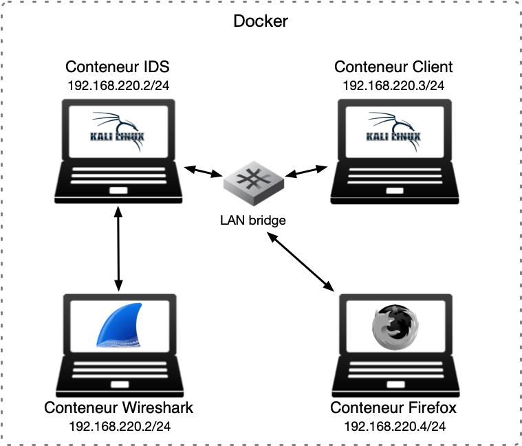
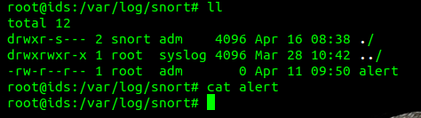
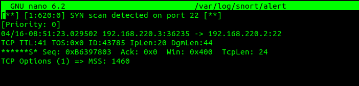

[](https://classroom.github.com/a/WBbLVFJ-)
# HEIGVD - Sécurité des Réseaux - 2024
# Laboratoire n°3 - IDS

Ce travail est à réaliser en équipes de deux personnes.
C'est le **deuxième travail noté** du cours SRX.

Vous pouvez répondre aux questions en modifiant directement votre clone du README.md ou avec un fichier pdf que vous pourrez uploader sur votre fork.

Le rendu consiste simplement à compléter toutes les parties marquées avec la mention "LIVRABLE". Le rendu doit se faire par un `git commit` sur la branche `main`.

## Table de matières

[Introduction](#introduction)

[Echéance](#echéance)

[Démarrage de l'environnement virtuel](#démarrage-de-lenvironnement-virtuel)

[Communication avec les conteneurs](#communication-avec-les-conteneurs)

[Configuration de la machine IDS et installation de Snort](#configuration-de-la-machine-ids-et-installation-de-snort)

[Essayer Snort](#essayer-snort)

[Utilisation comme IDS](#utilisation-comme-un-ids)

[Ecriture de règles](#ecriture-de-règles)

[Travail à effectuer](#exercises)

[Cleanup](#cleanup)

# Introduction

## Echéance

Ce travail devra être rendu au plus tard, **le 10 avril 2024 à 23h59.**


## Introduction

Dans ce travail de laboratoire, vous allez explorer un système de détection contre les intrusions (IDS) dont l'utilisation est très répandue grâce au fait qu'il est très performant tout en étant gratuit et open source. Il s'appelle [Snort](https://www.snort.org). Il existe des versions de Snort pour Linux et pour Windows.

### Les systèmes de détection d'intrusion

Un IDS peut "écouter" tout le traffic de la partie du réseau où il est installé. Sur la base d'une liste de règles, il déclenche des actions sur des paquets qui correspondent à la description de la règle.

Un exemple de règle pourrait être, en langage commun : "donner une alerte pour tous les paquets envoyés par le port http à un serveur web dans le réseau, qui contiennent le string 'cmd.exe'". En on peut trouver des règles très similaires dans les règles par défaut de Snort. Elles permettent de détecter, par exemple, si un attaquant essaie d'éxecuter un shell de commandes sur un serveur Web tournant sur Windows. On verra plus tard à quoi ressemblent ces règles.

Snort est un IDS très puissant. Il est gratuit pour l'utilisation personnelle et en entreprise, où il est très utilisé aussi pour la simple raison qu'il est l'un des systèmes IDS des plus efficaces.

Snort peut être exécuté comme un logiciel indépendant sur une machine ou comme un service qui tourne après chaque démarrage. Si vous voulez qu'il protège votre réseau, fonctionnant comme un IPS, il faudra l'installer "in-line" avec votre connexion Internet.

Par exemple, pour une petite entreprise avec un accès Internet avec un modem simple et un switch interconnectant une dizaine d'ordinateurs de bureau, il faudra utiliser une nouvelle machine éxecutant Snort et la placer entre le modem et le switch.


## Matériel

Vous avez besoin de votre ordinateur avec Docker et docker-compose. Vous trouverez tous les fichiers nécessaires pour générer l'environnement pour virtualiser ce labo dans le projet que vous avez cloné.
Vu qu'il faudra aussi faire un nat, sous Windows vous avez besoin de configurer votre docker pour
utiliser "Hyper-V" au lieu de "WSL2". Il faut désactiver la configuration [Use the WSL2 based engine](https://docs.docker.com/desktop/settings/windows/).


## Démarrage de l'environnement virtuel

Ce laboratoire utilise docker-compose, un outil pour la gestion d'applications utilisant multiples conteneurs. Il va se charger de créer un réseaux virtuel `snortlan`, la machine IDS, un client avec un navigateur Firefox, une machine "Client" et un conteneur Wireshark directement connecté à la même interface réseau que la machine IDS. C'est pour cela que les adresses IP du conteneur Wireshark et IDS sont identiques sur la figure en-dessous. Le réseau LAN interconnecte les autres 3 machines (voir schéma ci-dessous).



Nous allons commencer par lancer docker-compose. Il suffit de taper la commande suivante dans le répertoire racine du labo, celui qui contient le fichier [docker-compose.yml](docker-compose.yml). Optionnellement vous pouvez lancer le script [up.sh](scripts/up.sh) qui se trouve dans le répertoire [scripts](scripts), ainsi que d'autres scripts utiles pour vous :

```bash
docker compose up -d
```

Le téléchargement et génération des images prend peuError response from daemon: failed to create task for container: failed to create shim task: OCI runtime create failed: runc create failed: unable to start container process: error during container init: open /proc/sys/net/ipv4/conf/eth0/send_redirects: no such file or directory: unknown
- firefox

Pour accéder au terminal de l’une des machines, il suffit de taper :

```bash
docker compose exec bash
```

Par exemple, pour ouvrir un terminal sur votre IDS :

```bash
docker compose exec ids bash
```

Vous pouvez bien évidemment lancer des terminaux communiquant avec toutes les machines en même temps ou même lancer plusieurs terminaux sur la même machine. ***Il est en fait conseillé pour ce laboratoire de garder au moins deux terminaux ouverts sur la machine IDS en tout moment***.


### Configuration de la machine Client et de firefox

Dans un terminal de votre machine Client et de la machine firefox, taper les commandes suivantes :

```bash
ip route del default
ip route add default via 192.168.220.2
```

Ceci configure la machine IDS comme la passerelle par défaut pour les deux autres machines.


## Configuration de la machine IDS et installation de Snort

Pour permettre à votre machine Client de contacter l'Internet à travers la machine IDS, il faut juste une petite règle NAT par intermédiaire de nftables sur la machine IDS.
Si votre machine hôte est un Windows, il ne faut pas oublier de changer la configuration docker pour utiliser hyper-v.

```bash
nft add table nat
nft 'add chain nat postrouting { type nat hook postrouting priority 100 ; }'
nft add rule nat postrouting meta oifname "eth0" masquerade
```

Cette commande `iptables` définit une règle dans le tableau NAT qui permet la redirection de ports et donc, l'accès à l'Internet pour la machine Client.

On va maintenant installer Snort sur le conteneur IDS.

La manière la plus simple c'est d'installer Snort en ligne de commandes. Il suffit d'utiliser la commande suivante :

```
apt update && apt install -y snort
```

Ceci télécharge et installe la version la plus récente de Snort.

Il est possible que vers la fin de l'installation, on vous demande de fournir deux informations :

- Le nom de l'interface sur laquelle snort doit surveiller - il faudra répondre ```eth0```
- L'adresse de votre réseau HOME. Il s'agit du réseau que vous voulez protéger. Cela sert à configurer certaines variables pour Snort. Vous pouvez répondre ```192.168.220.0/24```.


## Essayer Snort

Une fois installé, vous pouvez lancer Snort comme un simple "sniffer". Pourtant, ceci capture tous les paquets, ce qui peut produire des fichiers de capture énormes si vous demandez de les journaliser. Il est beaucoup plus efficace d'utiliser des règles pour définir quel type de trafic est intéressant et laisser Snort ignorer le reste.

Snort se comporte de différentes manières en fonction des options que vous passez en ligne de commande au démarrage. Vous pouvez voir la grande liste d'options avec la commande suivante :

```
snort --help
```

On va commencer par observer tout simplement les entêtes des paquets IP utilisant la commande :

```
snort -v -i eth0
```

**ATTENTION : le choix de l'interface devient important si vous avez une machine avec plusieurs interfaces réseau. Dans notre cas, vous pouvez ignorer entièrement l'option ```-i eth0``` et cela devrait quand-même fonctionner correctement.**

Snort s'éxecute donc et montre sur l'écran tous les entêtes des paquets IP qui traversent l'interface eth0. Cette interface reçoit tout le trafic en provenance de la machine "Client" puisque nous avons configuré le IDS comme la passerelle par défaut.

Pour arrêter Snort, il suffit d'utiliser `CTRL-C`.

**attention** : généralement, vous devez patienter un moment avant que Snort s'arrête... Snort doit d'abbord finir de gérer le contenu du tampon de communication, ce qui peut prendre quelques secondes. Cependant, il peut arriver de temps à autres que Snort ne réponde plus correctement au signal d'arrêt. Dans ce cas-là on peut utliliser `CTRL-Z`, puis lancer la commande `pkill -f -9 snort`.


## Utilisation comme un IDS

Pour enregistrer seulement les alertes et pas tout le trafic, on execute Snort en mode IDS. Il faudra donc spécifier un fichier contenant des règles.

Il faut noter que `/etc/snort/snort.config` contient déjà des références aux fichiers de règles disponibles avec l'installation par défaut. Si on veut tester Snort avec des règles simples, on peut créer un fichier de config personnalisé (par exemple `mysnort.conf`) et importer un seul fichier de règles utilisant la directive "include".

Les fichiers de règles sont normalement stockés dans le répertoire `/etc/snort/rules/`, mais en fait un fichier de config et les fichiers de règles peuvent se trouver dans n'importe quel répertoire de la machine.

Par exemple, créez un fichier de config `mysnort.conf` dans le repertoire `/etc/snort` avec le contenu suivant :

```
include /etc/snort/rules/icmp2.rules
```

Ensuite, créez le fichier de règles `icmp2.rules` dans le repertoire `/etc/snort/rules/` et rajoutez dans ce fichier le contenu suivant :

```
alert icmp any any -> any any (msg:"ICMP Packet"; sid:4000001; rev:3;)
```

On peut maintenant éxecuter la commande :

```
snort -c /etc/snort/mysnort.conf
```

Vous pouvez maintenant faire quelques pings depuis votre "Client" et regarder les résultas dans le fichier d'alertes contenu dans le repertoire `/var/log/snort/`.

## Enlever les avertissements

Si on applique la règle en haut et qu'on fait un ping depuis une des machines `firefox` ou `Client`, snort
affiche l'avertissement suivant:

```
WARNING: No preprocessors configured for policy 0.
```

Ceci veut dire que snort a détécté une ou plusieurs règles qui ne sont pas précédées par un préprocesseur.
Pour ajouter un préprocesseur, vous pouvez ajouter la ligne suivante au début de votre fichier de configuration:

```
preprocessor frag3_global: max_frags 65536
```

## Ecriture de règles

Snort permet l'écriture de règles qui décrivent des tentatives de exploitation de vulnérabilités bien connues. Les règles Snort prennent en charge à la fois, l'analyse de protocoles et la recherche et identification de contenu.

Il y a deux principes de base à respecter :

* Une règle doit être entièrement contenue dans une seule ligne
* Les règles sont divisées en deux sections logiques : (1) l'entête et (2) les options.

L'entête de la règle contient l'action de la règle, le protocole, les adresses source et destination, et les ports source et destination.

L'option contient des messages d'alerte et de l'information concernant les parties du paquet dont le contenu doit être analysé. Par exemple:

```
alert tcp any any -> 192.168.220.0/24 111 (content:"|00 01 86 a5|"; msg: "mountd access";)
```

Cette règle décrit une alerte générée quand Snort trouve un paquet avec tous les attributs suivants :

* C'est un paquet TCP
* Emis depuis n'importe quelle adresse et depuis n'importe quel port
* A destination du réseau identifié par l'adresse 192.168.220.0/24 sur le port 111

Le text jusqu'au premier parenthèse est l'entête de la règle.

```
alert tcp any any -> 192.168.220.0/24 111
```

Les parties entre parenthèses sont les options de la règle:

```
(content:"|00 01 86 a5|"; msg: "mountd access";)
```

Les options peuvent apparaître une ou plusieurs fois. Par exemple :

```
alert tcp any any -> any 21 (content:"site exec"; content:"%"; msg:"site
exec buffer overflow attempt";)
```

La clé "content" apparait deux fois parce que les deux strings qui doivent être détectés n'apparaissent pas concaténés dans le paquet mais a des endroits différents. Pour que la règle soit déclenchée, il faut que le paquet contienne **les deux strings** "site exec" et "%".

Les éléments dans les options d'une règle sont traités comme un AND logique. La liste complète de règles sont traitées comme une succession de OR.

## Informations de base pour le règles

### Actions :

```
alert tcp any any -> any any (msg:"My Name!"; content:"Skon"; sid:1000001; rev:1;)
```

L'entête contient l'information qui décrit le "qui", le "où" et le "quoi" du paquet. Ça décrit aussi ce qui doit arriver quand un paquet correspond à tous les contenus dans la règle.

Le premier champ dans le règle c'est l'action. L'action dit à Snort ce qui doit être fait quand il trouve un paquet qui correspond à la règle. Il y a six actions :

* alert - générer une alerte et écrire le paquet dans le journal
* log - écrire le paquet dans le journal
* pass - ignorer le paquet
* drop - bloquer le paquet et l'ajouter au journal
* reject - bloquer le paquet, l'ajouter au journal et envoyer un `TCP reset` si le protocole est TCP ou un `ICMP port unreachable` si le protocole est UDP
* sdrop - bloquer le paquet sans écriture dans le journal

### Protocoles :

Le champ suivant c'est le protocole. Il y a trois protocoles IP qui peuvent être analysés par Snort : TCP, UDP et ICMP.


### Adresses IP :

La section suivante traite les adresses IP et les numéros de port. Le mot `any` peut être utilisé pour définir "n'import quelle adresse". On peut utiliser l'adresse d'une seule machine ou un block avec la notation CIDR.

Un opérateur de négation peut être appliqué aux adresses IP. Cet opérateur indique à Snort d'identifier toutes les adresses IP sauf celle indiquée. L'opérateur de négation est le `!`.

Par exemple, la règle du premier exemple peut être modifiée pour alerter pour le trafic dont l'origine est à l'extérieur du réseau :

```
alert tcp !192.168.220.0/24 any -> 192.168.220.0/24 111
(content: "|00 01 86 a5|"; msg: "external mountd access";)
```

### Numéros de Port :

Les ports peuvent être spécifiés de différentes manières, y-compris `any`, une définition numérique unique, une plage de ports ou une négation.

Les plages de ports utilisent l'opérateur `:`, qui peut être utilisé de différentes manières aussi :

```
log udp any any -> 192.168.220.0/24 1:1024
```

Journaliser le traffic UDP venant d'un port compris entre 1 et 1024.

--

```
log tcp any any -> 192.168.220.0/24 :6000
```

Journaliser le traffic TCP venant d'un port plus bas ou égal à 6000.

--

```
log tcp any :1024 -> 192.168.220.0/24 500:
```

Journaliser le traffic TCP venant d'un port privilégié (bien connu) plus grand ou égal à 500 mais jusqu'au port 1024.


### Opérateur de direction

L'opérateur de direction `->`indique l'orientation ou la "direction" du trafique.

Il y a aussi un opérateur bidirectionnel, indiqué avec le symbole `<>`, utile pour analyser les deux côtés de la conversation. Par exemple un échange telnet :

```
log 192.168.220.0/24 any <> 192.168.220.0/24 23
```

## Alertes et logs Snort

Si Snort détecte un paquet qui correspond à une règle, il envoie un message d'alerte ou il journalise le message. Les alertes peuvent être envoyées au syslog, journalisées dans un fichier text d'alertes ou affichées directement à l'écran.

Le système envoie **les alertes vers le syslog** et il peut en option envoyer **les paquets "offensifs" vers une structure de repertoires**.

Les alertes sont journalisées via syslog dans le fichier `/var/log/snort/alert`. Toute alerte se trouvant dans ce fichier aura son paquet correspondant dans le même repertoire, mais sous le fichier `snort.log.xxxxxxxxxx` où `xxxxxxxxxx` est l'heure Unix du commencement du journal.

Avec la règle suivante :

```
alert tcp any any -> 192.168.220.0/24 111
(content:"|00 01 86 a5|"; msg: "mountd access";)
```

un message d'alerte est envoyé à syslog avec l'information "mountd access". Ce message est enregistré dans `/var/log/snort/alert` et le vrai paquet responsable de l'alerte se trouvera dans un fichier dont le nom sera `/var/log/snort/snort.log.xxxxxxxxxx`.

Les fichiers log sont des fichiers binaires enregistrés en format pcap. Vous pouvez les ouvrir avec Wireshark ou les diriger directement sur la console avec la commande suivante :

```
tcpdump -r /var/log/snort/snort.log.xxxxxxxxxx
```

Vous pouvez aussi utiliser des captures Wireshark ou des fichiers snort.log.xxxxxxxxx comme source d'analyse pour Snort.

## Exercises

**Réaliser des captures d'écran des exercices suivants et les ajouter à vos réponses.**

### Essayer de répondre à ces questions en quelques mots, en réalisant des recherches sur Internet quand nécessaire :

**Question 1: Qu'est ce que signifie les "preprocesseurs" dans le contexte de Snort ?**

---

**Réponse :**  

Dans le contexte de Snort, les préprocesseurs permettent d'étendre les fonctionnalités de Snort en autorisant les utilisateurs et programmeurs de créer des plugins pour Snort de manière simple.

Ces modules effectuent des tâches spécifiques sur les paquets réseau avant qu'ils ne soient analysés par les règles de détection d'instrusion. Ils ont diverses fonctions comme la normalisation des paquets, la fragmentation, la détection de protocole, la reconfiguration dynamique etc...

Le code préprocesseur est chargé et configuré en utilisant le mot clé `preprocessor`. 
 

---

**Question 2: Pourquoi êtes vous confronté au WARNING suivant `"No preprocessors configured for policy 0"` lorsque vous exécutez la commande `snort` avec un fichier de règles ou de configuration "fait-maison" ?**

---

**Réponse :**  

Snort ne détecte aucune configuration de préprocesseur pour la politique de sécurité 0 (politique par défaut) dans le fichier de configuration fait "maison". Cela signifie que le fichier ne contient pas les directives nécessaires pour initialiser les préprocesseurs, qui sont essentiels pour le traitement préliminaire des paquets.

---

--

### Trouver du contenu :

Considérer la règle simple suivante:

alert tcp any any -> any any (msg:"Mon nom!"; content:"Rubinstein"; sid:4000015; rev:1;)

**Question 3: Qu'est-ce qu'elle fait la règle et comment ça fonctionne ?**

---

**Réponse :**  

- `alert` -> génère une alerte et écrit le paquet dans le journal
  
- `tcp any any -> any any` -> spécifie la règle qui s'applique au traffic TCP qui provient de n'importe quelle adresse source et de n'importe quel port source en se dirigeant vers n'importe quelle adresse de destination et n'importe quel port de destination.
  
- `msg` -> option permettant d'ajouter une description à la règle et sera le message d'alert lors de l'évènement généré. Cette option msg prend juste un string en paramètre.
  
- `content` -> permet d'indiquer le contenu recherché dans le traffic. Donc si le mot "Rubinstein" est trouvé dans les données de la couche application des paquets TCP alors une alerte sera déclenchée. Cette règle peut également avoir le `!` pour indiquer que c'est lorsque le paquet ne contient pas ce mot qu'il faut déclenché l'alerte. Une règle peut contenir plusieurs content et chaque content et évalué dans l'ordre dans lequel ils sont déclaré. Donc il est important de mettre les conditions uniques au début de la règle pour être sûr qu'il lis cette condition à chaque paquet.
  
- `sid` -> permet d'indiquer la valeur numérique **unique** qui doit être donnée à cette règle. Chaque règle Snort doit avoir un sid **unique**. Les valeurs numériques entre 0 - 999999 sont réservées pour Snort donc les utilisateurs doivent utiliser les valeurs qui commence à 1000000.
  
- `rev` -> Indique le numéros d'identification d'une règle Snort. Il indique la version de la règle et donc à changement fait sur la règle il faut incrémenter le rev. Les valeurs de révision commence à 1.

---

Utiliser nano ou vim pour créer un fichier `myrules.rules` sur votre répertoire home (`/root`). Rajouter une règle comme celle montrée avant mais avec votre text, phrase ou mot clé que vous aimeriez détecter. Lancer Snort avec la commande suivante :

```
snort -c myrules.rules -i eth0
```

Pour certaines installations docker, il faut plutôt utiliser ceci:

```
snort -c myrules.rules -P 65535 -k none
```

**Question 4: Que voyez-vous quand le logiciel est lancé ? Qu'est-ce que tous ces messages affichés veulent dire ?**

---

**Réponse :**  


**Partie 1** : La machine hôte fonctionne en mode IDS.

**Partie 2** : Annonce et initialise Snort en démarrant l'initialisation des préprocesseurs, des plugins, les règles, définit la limite des paquets, indique le répertoire de journalisation (`/var/log/snort`).

**Partie 3** : Débute l'initialistion des chaînes de règles. Snort lit et trouve une règle de détection.

**Partie 4** : Résumé des comptages des ports des règles chargées depuis le fichier de règles. Dans notre cas on a uniquement 1 règle avec le mot-clé any pour une règle concernant le protocole TCP.

**Partie 5** : Configure le filtre de détection, spécifie les règles de filtrages de détection, configure le filtre de taux, le filtre d'événements global et local et de supression.

- Detection-filter
  - memory-cap -> limite la mémoire pour les filtres de détection.
  - detection-filter-rules -> les règles de filtre de détection configurée. Les filtres de détection sont uitlisés pour limiter le déclenchement d'alertes lorsqu'un certain seuil de déclenchement d'alertes est atteint dans un intervalle de temps spécifié.

- Rate-filter
  - memory-cap -> limite la mémoire pour les filtres de taux.
  - rate-filter-rules -> règles de filtre de taux configurée. Les filtres de taux sont utilisés pour limiter le déclenchement d'alertes lorsque le taux d'alertes dépasse un certain seuil.

- Event-filter
  - memory-cap -> limite de mémoire pour les filtres d'événements.
  - event-filter-global -> configuration globale de filtre d'événements définie
  - event-filter-local -> règle de filtre d'événements locale configurée. Les filtres d'événements sont utilisés pour limiter le nombre d'alertes déclenchées pour des événements spécifiques.
  - suppression -> règle de suppression configurée. Les règles de suppression sont utilisées pour supprimer certaines alertes en fonction de critères spécifiques.


**Partie 6** : Définit l'ordre des applications des règles. Vérifie les configurations des préprocesseurs.

**Partie 7** : Affiche les informations sur la mémoire utilisée pour la recherche de correspondance de motifs basée sur les ports.

Snort utilise un algorithme de recherche de motifs appelé "Aho-Corasick with Built-In Non-deterministic Finite Automaton" (AC-BNFA).

Voici les détails de cette partie du message :

- Instances : Le nombre d'instances de l'algorithme de recherche AC-BNFA utilisées (1 dans ce cas).

- Patterns : Le nombre de motifs de recherche dans les règles chargées (1 dans ce cas, qui correspond au motif "Rubinstein" dans la règle que vous avez fournie).

- Pattern Chars : Le nombre total de caractères dans les motifs (4 dans ce cas, correspondant aux 4 caractères de "Rubinstein").

- Num States : Le nombre total d'états dans l'automate fini non-déterministe (4 dans ce cas).

- Num Match States : Le nombre d'états correspondant à des motifs trouvés (1 dans ce cas).

- Memory : La mémoire totale utilisée par l'automate fini non-déterministe. Cette mémoire est répartie entre les éléments suivants :
        Patterns : La mémoire utilisée pour stocker les motifs.
        Match Lists : La mémoire utilisée pour stocker les listes de correspondances.
        Transitions : La mémoire utilisée pour stocker les transitions entre les états.


**Partie 8** : Configure le pcap DAQ en mode passif. Acquière le traffic réseau depuis "eth0". Cette partie indique que Snort est prêt à commencer à analyser le trafic réseau en utilisant l'interface "eth0" ce qui avait été demandé lors de la commande d'exécution de Snort.


    pcap DAQ configured to passive. : Snort utilise le module "pcap" (Packet Capture) comme dispositif d'acquisition de paquets (DAQ) en mode passif. Cela signifie que Snort capture et analyse les paquets, mais ne modifie pas ou n'interagit pas avec le trafic réseau.

    Acquiring network traffic from "eth0". : Snort commence à acquérir et à analyser le trafic réseau à partir de l'interface réseau "eth0".

    Reload thread starting... : Un nouveau thread de rechargement est lancé. Ce thread permet de recharger la configuration de Snort et les règles à la volée, sans interrompre l'analyse du trafic réseau.

    Reload thread started, thread 0x7f60ab658640 (1010) : Le thread de rechargement a démarré avec succès et est identifié par l'adresse mémoire 0x7f60ab658640 et le numéro de thread 1010.- -

    Decoding Ethernet : Snort décode les paquets capturés en utilisant le protocole Ethernet. Cela signifie que Snort est prêt à analyser les paquets Ethernet et à appliquer les règles de détection définies dans votre fichier de règles.


**Partie 9** : Annonce la fin du processus d'initialisation et que le système est prêt à commencer à analyser le réseaux.

Il indique la version de Snort, certains noms, et les versions utilisées des library.

**Partie 10** : Commence l'écoute et analyse le réseaux. Le processus est identifié par un PID qui est l'ID du processus en cours.

Pour résumé, cela nous permet de voir toutes les règles utilisées par Snort, ainsi que les emplacements des fichiers important comme les fichiers log, rules, ....

---

Aller sur un site web contenant dans son texte la phrase ou le mot clé que vous avez choisi (il faudra chercher un peu pour trouver un site en http... Si vous n'y arrivez pas, vous pouvez utiliser [http://neverssl.com](http://neverssl.com) et modifier votre  règle pour détecter un morceau de texte contenu dans le site).

Pour accéder à Firefox dans son conteneur, ouvrez votre navigateur web sur votre machine hôte et dirigez-le vers [http://localhost:4000](http://localhost:4000). Optionnellement, vous pouvez utiliser wget sur la machine client pour lancer la requête http ou le navigateur Web lynx - il suffit de taper `lynx neverssl.com`. Le navigateur lynx est un navigateur basé sur texte, sans interface graphique.
Chez moi, Linus, je n'arrive pas à entrer du texte si j'utilise le lien sous Firefox. Mais sous Safari et Chrome ça marche.

**Question 5: Que voyez-vous sur votre terminal quand vous chargez le site depuis Firefox ou la machine Client ?**

---

**Réponse :**  


En faisant `lynx neverssl.com` on peut atteindre la page au travers du terminal et voir tout le texte du site directement dans son terminal comme sur l'image.

---

Arrêter Snort avec `CTRL-C`.

**Question 6: Que voyez-vous quand vous arrêtez snort ? Décrivez en détail toutes les informations qu'il vous fournit.**

---

**Réponse :**  


1. Résumé du temps d'exécution :
Des statistiques de temps d'exécution, y compris le temps total écoulé, le nombre de paquets traités et le taux de traitement des paquets.

2. Résumé de l'utilisation de la mémoire :
Détaille l'utilisation de la mémoire, notamment l'espace total alloué, l'espace libre total et d'autres métriques liées à la mémoire.

3. Totals d'Input / Output de paquets :
Elle montre le nombre de paquets reçus, analysés, abandonnés et en attente pendant son exécution.

4. Répartition par protocole : La répartition des paquets traités en fonction de leur protocole.

5. Statistiques d'action, limites et verdicts: Les actions faitent en fonction des menaces détectées. Le nombre d'alertes montre celle qui sont générées et enregistrées. Les limites configurées sur les actions et les verdicts appliqués aux paquets.

6. Statistiques de Frag3 : Du moteur de détection de fragmentation de Snort (Frag3), les données sont notamment le nombre total de fragments traités, les fragments réassemblés, les rejets, les anomalies, les alertes et les rejets.

7. Fin du processus
---


Aller au répertoire /var/log/snort. Ouvrir le fichier `alert`. Vérifier qu'il y ait des alertes pour votre text choisi.

**Question 7: A quoi ressemble l'alerte ? Qu'est-ce que chaque élément de l'alerte veut dire ? Décrivez-la en détail !**

---

**Réponse :**  


Sur la capture d'écran, on peut voir que les alertes sont déclenchées par la règle de détection numéro 1:4000015:1 qui affiche le message "NeverSSL founded".

Les alertes contiennent les informations suivantes :


**Numéro de l'alerte** : `[1:4000015:1]` indique que c'est la première alerte générée par la règle avec le SID (Snort ID) 4000015 et la révision 1 de cette règle.

**Message d'alerte** : `"NeverSSL founded"` est le message configuré dans la règle Snort, qui est affiché lorsqu'une correspondance est trouvée.

**Priorité** : `[Priority: 0]` spécifie la priorité de l'alerte, avec 0 étant généralement la priorité la plus élevée.

**Timestamp** : `03/29-16:25:12.398930` montre la date et l'heure exactes de la détection de l'alerte.

**Adresses IP et ports source/destination** : `34.223.124.45:80 -> 192.168.220.2:47838` montre l'adresse IP et le port source de l'expéditeur et ceux de la destination.

**Paramètres TCP** :
- **TTL** (`TTL:63`) : Time-to-live du paquet TCP.
- **TOS** (`TOS:0x0`) : Type of Service, indique la qualité de service désirée.
- **ID** (`ID:2226`) : Identifiant unique du paquet IP pour reconstituer les fragments de paquets.
- **IpLen** (`IpLen:20`) : Longueur de l'en-tête IP.
- **DgmLen** (`DgmLen:1500`) : Longueur totale du datagramme.

**Séquence TCP et options** :
- **Seq** (`Seq: 0xE1E45F8DF`) : Numéro de séquence TCP.
- **Ack** (`Ack: 0xEFD7678E`) : Numéro d'acquittement TCP.
- **Win** (`Win: 0x1000`) : Fenêtre de congestion TCP.
- **TcpLen** : Longueur de l'en-tête TCP.
- **Options** (`TCP Options (3) => NOP NOP TS: 2062611332 188932505`) : Options TCP présentes dans le paquet, NOP est une option qui ne fait rien et TS est le timestamp.


---

### Detecter une visite à Wikipedia

Ecrire deux règles qui journalisent (sans alerter) chacune un message à chaque fois que Wikipedia est visité **SPECIFIQUEMENT DEPUIS VOTRE MACHINE CLIENT OU DEPUIS FIREFOX**. Chaque règle doit identifier quelle machine à réalisé la visite. Ne pas utiliser une règle qui détecte un string ou du contenu. Il faudra se baser sur d'autres paramètres.

**Question 8: Quelle est votre règle ? Où le message a-t'il été journalisé ? Qu'est-ce qui a été journalisé ?**

---

**Réponse :** 

Pour ne pas alerter mais seulement journaliser il nous faut utiliser `log` avec les adresses voulues. Ici, nous voulont journaliser les visites sur wikipedia sans utiliser de règles utilisant une string. Pour se faire nous avons fait un `wget wikipedia.org` afin de récupérer l'adresse ip de wikipedia.


Voici les règles que nous avons créé :

```bash
// Règle pour la journalisation des visites sur wikipedia depuis le client

log tcp 192.168.220.3 any -> 185.15.58.224 any (msg:"Visite sur wikipedia depuis le client"; sid:4000001;)

// Règle pour la journalisation des visites sur wikipedia depuis Firefox 

log tcp 192.168.220.3 any -> 185.15.58.224 any (msg:"Visite sur wikipedia depuis firefox"; sid:4000002;)
```

**Règle pour le client** : Nous faisons un log tcp depuis l'adresse ip source du client (192.168.220.3) concernant tous les paquets allant jusqu'à l'adresse ip de wikipedia (185.15.38.224) avec le message de log permettant de distinguer les 2 types de log entre le client et firefox.

**Règle pour firefox** : Nous faisons un log tcp depuis l'adresse ip source de firefox (192.168.220.3) concernant tous les paquets allant jusqu'à l'adresse ip de wikipedia, avec le message de log permettant de distinguer les 2 types de log entre le client et firefox.


Ces règles nous les ajoutons dans le fichier `wikipedia.rules` qui se trouvent à `/etc/snort/rules/wikipedia.rules`. Ensuite pour pouvoir l'include lors de l'exécution du fichier `mysnort.conf` nous avons changé dans le fichier de configuration à `/etc/snort/mysnort.conf` le contenu par le contenu suivant : 

```bash
preprocessor frag3_global: max_frags 65536
include /etc/snort/rules/wikipedia.rules
```

Ainsi maintenant, nous pouvons lancer l'exécution de Snort via la commande suivante :

```bash
snort -c /etc/snort/mysnort.conf
```

Les messages ne sont pas journalisés dans alert, car ils ne contiennent pas de règles `alert` mais des règles `log`et donc il sont journalisés dans `/var/log/snort` au travers des fichiers `snort.log.xxxxxxxx`.

En ouvrant un fichier snort.log avec la commande `tcpdump -r snort.log.xxxxxx` on peut y trouver le contenu suivant :


On remarque bien que autant le client que firefox ont été mis dans les logs. Nos règles fonctionnent.

Ce qui a été journalisé dans le fichier snort.log est :

- L'heure précise ou l'événement a été enregistré.
- L'adresse source -> client.snortlan.50934 / 50946
- L'adresse de destination -> text-lb.drmrs.wikimedia.org.https
- Les flags [R] qui indique que le paquet TCP est un paquet de réinitialisation
- seq -> le numéro de séquence du paquet TCP
- win -> la taille de la fenêtre TCP
- length -> la longueur du paquet.

---

--

### Détecter un ping d'un autre système

Ecrire une règle qui alerte à chaque fois que votre machine IDS **reçoit** un ping depuis une autre machine (n'import laquelle des autres machines de votre réseau). Assurez-vous que **ça n'alerte pas** quand c'est vous qui **envoyez** le ping depuis l'IDS vers un autre système !

**Question 9: Quelle est votre règle ?**

---

**Réponse :**  
```
alert icmp 192.168.220.0/24 any -> 192.168.220.2 any (msg:"ICMP Packet"; sid:4000002;)
```
---


**Question 10: Comment avez-vous fait pour que ça identifie seulement les pings entrants ?**

---

**Réponse :**  
```
L'alerte détecte uniquement les ping à destination de la machine IDS(192.168.220.2) provenant uniquement d'une machine du sous-réseau 192.168.220.0/24.
```
---


**Question 11: Où le message a-t-il été journalisé ?**

---

**Réponse :**  
Les alertes ont été créer dans le fichier alert situé dans le dossier : `/var/log/snort/`


---

Les journaux sont générés en format pcap. Vous pouvez donc les lire avec Wireshark. Vous pouvez utiliser le conteneur wireshark en dirigeant le navigateur Web de votre hôte sur vers [http://localhost:3000](http://localhost:3000). Optionnellement, vous pouvez lire les fichiers log utilisant la commande `tshark -r nom_fichier_log` depuis votre IDS.

**Question 12: Qu'est-ce qui a été journalisé ?**

---

**Réponse :**  


Le contenu est structuré en 7 colonnes :

1. Numéro de ligne: la ligne dans le fichier de journal.
2. Temps écoulé: Le temps écoulé depuis le début de la capture.
3. Source: L'adresse IP source du packet ICMP.
4. Destination: L'adresse IP de destination du paquet ICMP.
5. Protocole: ICMP
6. Longueur: La longueur du paquet ICMP en octets.
7. Infos: Des informations supplémentaires telles que le type de message ICMP (Echo request, Echo reply), l'ID du paquet et le numéro de séquence.
---

---

### Detecter les ping dans les deux sens

Faites le nécessaire pour que les pings soient détectés dans les deux sens.

**Question 13: Qu'est-ce que vous avez fait pour détecter maintenant le trafic dans les deux sens ?**

---

**Réponse :**  

Pour permettre une alerte lorsque les pings se font dans les deux sens nous avons implémenté la règle suivante :

```bash
alert icmp 192.168.220.0/24 any <> 192.168.220.2 any (msg:"ICMP packet - two ways"; sid:4000003;)
```

L'opérateur `<>` permet d'appliquer la règle dans les deux sens.

Pour vérification, on modifie donc le fichier `/etc/snort/rules/icmp2.rules` avec la nouvelle règle ainsi que le fichier `/etc/snort/mysnort.conf` pour include le fichier icmp2.rules et nous exécutons snort avec la commande suivante :

```bash
snort -c /etc/snort/mysnort.conf
```

Ensuite pour vérifer le bon fonctionnement de la règle nous faisons un ping depuis le client vers l'IDS et depuis l'IDS vers le client.

On peut voir avec cette capture d'écran le bon fonctionnement de la règle :


---


---

### Detecter une tentative de login SSH

Essayer d'écrire une règle qui Alerte qu'une tentative de session SSH a été faite depuis la machine Client sur l'IDS.

**Question 14: Quelle est votre règle ? Montrer la règle et expliquer en détail comment elle fonctionne.**

---

**Réponse :**  

Pour alerter une tentative de session SSH depuis le client sur l'IDS il faut créer une règle qui va depuis l'adresse ip du client vers l'adresse ip de l'IDS mais en précisant le port 22 qui est le port SSH. Comme cela si l'on tente une connexion SSH (reconnue grâce au port 22) alors une alerte sera mise dans le fichier `/var/log/snort/alert`.

Voici la règle :

```bash
alert tcp 192.168.220.3 any -> 192.168.220.2 22 (msg:"Tentative session SSH depuis client"; sid:4000004;)
```

Nous avons inscrit cette commande dans le fichier `/etc/snort/rules/ssh.rules` tout en modifiant comme suit le fichier `/etc/snort/mysnort.conf`:

```bash
preprocessor frag3_global: max_frags 65536
include /etc/snort/rules/ssh.rules
```

Maintenant nous pouvons exécuter snort avec la commande suivante :

```bash
snort -c /etc/snort/mysnort.conf -k none
```
Pour que snort ne tente aucun bloquage ou ne tente pas de réinitialiser les paquets suspects (comme pour une connexion ssh par exemple si elle n'est pas autorisée, comme c'est le cas lors d'une prochaine capture d'écran) alors nous ajoutons l'option `-k none` pour indiquer à snort de ne prendre aucune décision et rester en mode passif.

Puis sur le terminal du client nous avons lancé la commande suivante pour tenter une connexion ssh avec l'IDS :

```bash
ssh 192.168.220.2
```


Comme expliqué plutôt ici on voit que la connexion est refusée et donc il nous faut indiquer l'option `-k none` pour mettre snort en mode passif.

---


**Question 15: Montrer le message enregistré dans le fichier d'alertes.**

---

**Réponse :**  

voici le résultat apparu dans le fichier `/var/log/snort/alert` :


On observe bien la tentative de connexion ssh du client (192.168.220.3) envers l'IDS (192.168.220.2) avec le port 22.

On voit également que les options sont favorables à une tentative de connexion qui aurait été refusée car si l'on prend l'option TCP ******S*, cela indique que ce paquet est une demande de connexion SYN mais sans obtenir de réponse SYN-ACK de l'adresse de destination... Et lors de la question 14, on voit que la connexion a été refusée.

---

--

### Analyse de logs

Depuis l'IDS, servez-vous de l'outil ```tshark```pour capturer du trafic dans un fichier. ```tshark``` est une version en ligne de commandes de ```Wireshark```, sans interface graphique.

Pour lancer une capture dans un fichier, utiliser la commande suivante :

```
tshark -w nom_fichier.pcap
```

Générez du trafic depuis le deuxième terminal qui corresponde à l'une des règles que vous avez ajoutées à votre fichier de configuration personnel. Arrêtez la capture avec ```Ctrl-C```.

**Question 16: Quelle est l'option de Snort qui permet d'analyser un fichier pcap ou un fichier log ?**

---

**Réponse :**  
L'option -r de Snort permet d'analyser un fichier pcap ou un fichier log.
La commande :
```
snort -r /chemin/au/nom_fichier.pcap
ou
snort -r /chemin/au/nom_fichier_log
```
---

Utiliser l'option correcte de Snort pour analyser le fichier de capture Wireshark que vous venez de générer.

**Question 17: Quelle est le comportement de Snort avec un fichier de capture ? Y-a-t'il une différence par rapport à l'analyse en temps réel ?**

---

**Réponse :**  
Le comportement de Snort est le même avec un fichier de capture qu'avec une analyse en temps réel.


---

**Question 18: Est-ce que des alertes sont aussi enregistrées dans le fichier d'alertes?**

---

**Réponse :**  
Oui, Snort ajoute aussi les alerte au fichier de la même manière qu'il l'aurait fait avec une analyse en temps réel.

---

### Contournement de la détection

Faire des recherches à propos des outils `fragroute` et `fragrouter`.

**Question 19: A quoi servent ces deux outils ?**

---

**Réponse :**  

Comme on le sait, les données qui parcours internet, sont sous forme de paquets. Sur un réseau si les paquets sont plus grand que le MTU (Maximum Transmission Unit) alors ces paquets sont "séparés" en plus petit paquets pour pouvoir entrer dans le réseau facilement. Ces plus petits paquets sont des fragments et `fragroute` utilise ces fragments afin d'intercepter, modifier et retransmettre le trafic spécifié pour un certain hôte.

Fragroute permet donc de manipuler les paquets réseau alors que fragrouter permet de rouer le trafic réseau à travers un réseau en utilisant la fragmentation. Donc il fait presque la même chose que fragroute mais il permet plutôt de rediriger le trafic
vers des destinations spécifiques ou pour dissimuler la source du trafic.

---


**Question 20: Quel est le principe de fonctionnement ?**

---

**Réponse :**  

Donc comme expliquer plutôt fragroute et fragrouter utilise tous les deux la fragmentation pour en arriver à leur but. Donc les paquets sont séparés en plus petit paquets pour permettre dans certains cas une meilleure rapidité de transfert grâce à la parrallélisation, mais surtout à une meilleure adaptation pour chacun des réseaux à travers lequel le paquet va passer.

Grâce à la fragmentation fragroute et fragrouter peuvent faire :
- manipulation de paquets -> donc modification de l'apparence du paquets.
- fragmentation des paquets -> cache la source, bypass la sécurité ou cache le contenu.
- routage du trafic -> surtout fragrouter fait cela et peut donc changer la direction du paquets.
- Evitement des détections -> permet d'éviter de se faire détecter par un IDS, ou encore un firewall car le trafic apparaît différemment.

---


**Question 21: Qu'est-ce que le `Frag3 Preprocessor` ? A quoi ça sert et comment ça fonctionne ?**

---

**Réponse :**  

Le `Frag3 Preprocessor` permet de faire de l'analyse dite `target-based`. Le terme target-based signifie que c'est un IDS intelligent qui est au courant des hosts sur le réseau et est capable d'analyser le trafic et donc permet d'améliorer la précisions de détection d'instrusion de l'IDS Snort. La où il est intéressant c'est qu'il peut gérer la fragmentation des paquets réseau pour mieux détecter les attaques qui exploitent justement la technique de fragmentation et donc permet de contrer fragroute et fragrouter. Il est utiliser dans la défense des attaques par fragmentation alors que fragroute et fragrouter eux sont utilisés pour créer des attaques de fragmentation.

Son fonctionnement est le suivant : 
- Frag3 preprocessor surveille le trafic entrant en cherchant les datagrammes fragmentés et examine individuellement les en-têtes IP pour identifier les fragments.
- Réassemblage des fragments -> lorsqu'il détecte des fragments de paquets, il réassemble les fragments dans l'ordre pour obtenir une vue complète sur le datagramme.
- Vérification de l'intégrité -> il vérifie que les datagrammes soient correctement formé et complets. Ainsi il peut vérifier les fragments manquant, qui ne respectent pas l'intégrité ou qui ne sont pas valides.
- Application des règles -> si ils sont jugés valides alors Frag3 applique les règles de détection définies par le user ou par Snort permettant de détecter une attaque ou intrusion.
- Alertes -> pour finir si une activité malveillante est détectée alors il fait une alerte.

---


L'utilisation des outils ```Fragroute``` et ```Fragrouter``` nécessite une infrastructure un peu plus complexe. On va donc utiliser autre chose pour essayer de contourner la détection.

L'outil nmap propose une option qui fragmente les messages afin d'essayer de contourner la détection des IDS. Générez une règle qui détecte un SYN scan sur le port 22 de votre IDS.


**Question 22: A quoi ressemble la règle que vous avez configurée ?**

---

**Réponse :**

```
alert tcp any any -> 192.168.220.2 22 ( msg: "SYN scan detected on port 22"; flags: S,12; sid: 620;)
```

---

Pour cet exercice, vous devez d'abord désactiver le préprocesseur `frag3_global`, avant de le réactiver plus tard.
Le plus simple est d'ajouter un `#` au début de la ligne, ainsi elle est ignorée par snort.

Ensuite, servez-vous du logiciel nmap pour lancer un SYN scan sur le port 22 depuis la machine Client :

```
nmap -sS -p 22 192.168.220.2
```
Vérifiez que votre règle fonctionne correctement pour détecter cette tentative.

Ensuite, modifiez votre commande nmap pour fragmenter l'attaque :

```
nmap -sS -f -p 22 --send-eth 192.168.220.2
```

**Question 23: Quel est le résultat de votre tentative ?**

---

**Réponse :**  
Lors du premier scan, Snort a créer une alerte pour le scan SYN.


Cependant, lorsque nous avons exécuter la seconde commande aucune alerte n'a été créer dans le fichier alert.

---


Modifier le fichier `myrules.rules` pour que snort utiliser le `Frag3 Preprocessor` et refaire la tentative.


**Question 24: Quel est le résultat ?**

---

**Réponse :**  

Dans le fichier `myrules.conf` nous avons ajouté la commande suivante :

```
preprocessor frag3_global: max_frags 65536
```

Après avoir ajouté la commande nous avons refait la commande depuis le client pour pouvoir faire le syn scan. Il n'y a aucune alert dans le fichier alert...



Après quelque recherche nous avons trouvé la solution en ajoutant la commande suivante au fichier `myrules.conf` :

```
preprocessor frag3_engine: policy linux detect_anomalies overlap_limit 10 min_fragment_length 100 timeout 180
```

Cette commande permet de configurer le frag3_engine preprocessor afin de pouvoir gérer le trafic fragmenté sur un réseau. Sans cette commande, le fichier alert est vide...

Voici le résultat qui est fonctionnel :



---


**Question 25: A quoi sert le `SSL/TLS Preprocessor` ?**

---

**Réponse :**  
Le Préprocesseur Dynamique SSL décode le trafic SSL et TLS, ce qui permet à Snort de décider s'il doit inspecter ou non le trafic. Par défaut,les paquets SSL sont inspectés sur le port 443, cependant snort arrête l'inspection une fois le trafic déterminé comme chiffré. 

Ce module peut aussi vérifier la validité des certificats SSL/TLS.

---


**Question 26: A quoi sert le `Sensitive Data Preprocessor` ?**

---

**Réponse :**  
Le Préprocesseur de données sensibles détecte et filtre des Personally Identifiable Information(PII).
Cela inclut les numéros de carte de crédit, numéros de sécurité social et adresses mail. Une syntave d'expression régulière permet de définir nos propres PII.

---

### Conclusions


**Question 27: Donnez-nous vos conclusions et votre opinion à propos de snort**

---

**Réponse :**  

Ce laboratoire a été une découverte enrichissante nous permettant de rendre plus clair les concepts étudiés en classe. La mise en pratique nous a montré que lorsqu'il est bien configuré/ajusté, Snort peut-être un instrument très puissant pour la surveillance du réseau.

---

<sub>This guide draws heavily on https://web.archive.org/web/20190419040733/http://cs.mvnu.edu/twiki/bin/view/Main/CisLab82014</sub>
