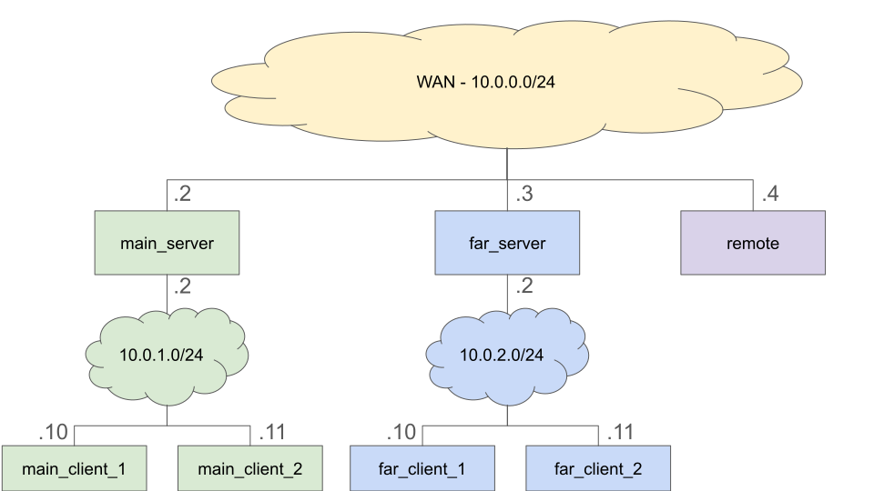

[](https://classroom.github.com/a/cUBNOxfy)
# HEIGVD - Sécurité des Réseaux - 2024

# Laboratoire n°5 - VPN

Ce travail est à réaliser en équipes de deux personnes.
Choisissez une personne avec qui vous n'avez pas encore travaillé pour un labo du cours SRX.
C'est le **troisième travail noté** du cours SRX.

Répondez aux questions en modifiant directement votre clone du README.md.

Le rendu consiste simplement à compléter toutes les parties marquées avec la mention "LIVRABLE".
Le rendu doit se faire par un `git commit` sur la branche `main`.

## Table de matières

- [HEIGVD - Sécurité des Réseaux - 2024](#heigvd---sécurité-des-réseaux---2024)
- [Laboratoire n°5 - VPN](#laboratoire-n5---vpn)
  - [Table de matières](#table-de-matières)
- [Introduction](#introduction)
  - [Échéance](#échéance)
  - [Évaluation](#évaluation)
  - [Introduction](#introduction-1)
  - [Configuration](#configuration)
  - [Test](#test)
- [OpenVPN](#openvpn)
  - [Mise en place du CA](#mise-en-place-du-ca)
  - [Réseau à réseau](#réseau-à-réseau)
  - [Remote à réseau](#remote-à-réseau)
  - [Tests](#tests)
  - [Desktop à réseau](#desktop-à-réseau)
- [WireGuard](#wireguard)
  - [Création des clés](#création-des-clés)
  - [Réseau à réseau](#réseau-à-réseau-1)
  - [Remote à réseau](#remote-à-réseau-1)
  - [Test](#test-1)
  - [Bonus: Desktop à réseau](#bonus-desktop-à-réseau)
- [IPSec](#ipsec)
  - [Mise en place du CA](#mise-en-place-du-ca-1)
  - [Réseau à réseau](#réseau-à-réseau-2)
  - [Remote à Réseau](#remote-à-réseau-2)
  - [Test](#test-2)
- [Comparaison](#comparaison)
  - [Sécurité](#sécurité)
  - [Facilité d'utilisation](#facilité-dutilisation)
  - [Performance](#performance)
- [Points spécifiques](#points-spécifiques)
  - [OpenVPN](#openvpn-1)
  - [WireGuard](#wireguard-1)
  - [IPSec](#ipsec-1)

# Introduction

## Échéance

Ce travail devra être rendu au plus tard, **le 29 mai 2024 à 23h59.**

## Évaluation

Vous trouverez le nombre de points pour chaque question derrière le numéro de la question:

**Question 1 (2):**

Désigne la 1ère question, qui donne 2 points.
La note finale est calculée linéairement entre 1 et 6 sur le nombre de points totaux.
Les pénalités suivantes sont appliquées:

- 1/2 note pour chaque tranche de 24h de retard

À la fin du document, vous trouverez **une liste de points supplémentaires qui seront évalués** sur la base de votre
code rendu.

## Introduction

Ce labo va vous présenter trois types de VPNs: OpenVPN, WireGuard et IPSec.
On va voir au cours une partie de la configuration, pour le reste, vous devez faire
vos propres recherches sur internet.
La quatrième partie vous demande de faire une comparaison des différents VPNs vu dans ce labo.

Les trois VPNs vont être fait avec deux connexions différentes:

- une pour connecter deux réseaux distants, `main` et `far`
- une pour connecter un ordinateur `remote` pour faire partie du réseau `main`

Pour OpenVPN, vous devez aussi connecter votre ordinateur hôte au réseau docker.

Il y a trois réseaux:

- 10.0.0.0/24 - fait office d'internet - toutes les adresses "publiques" des passerelles de
  `main` et `far`, ainsi que le `remote` seront dans cette plage.
  L'ordinateur distant a l'adresse publique 10.0.0.4
- 10.0.1.0/24 - le réseau `main` avec le serveur VPN, adresse publique de 10.0.0.2
- 10.0.2.0/24 - le réseau `far` qui sera à connecter au réseau `main`, adresse publique de 10.0.0.3

Pour les deux réseaux, on aura chaque fois trois machines:

- serveur: avec le host-IP = 2 et une adresse publique correspondante
- client1: avec le host-IP = 10
- client2: avec le host-IP = 11



Les deux serveurs vont faire un routing des paquets avec un simple NAT.
Docker ajoute une adresse avec le host-IP de 1 qui est utilisée pour router le trafic vers l'internet.

Une fois la connexion VPN établie, vous devrez vous assurer que:

- toutes les machines connectées peuvent échanger des paquets entre eux
- tous les paquets entre les réseaux et l'ordinateur distant passent par le VPN.

Vous pouvez utiliser le script décrit dans [Test](#test) pour cela.

## Configuration

Vu que vous devez faire trois configurations qui se basent sur les mêmes images docker,
j'ai ajouté une configuration automatique.
Ceci vous permet de travailler sur les trois configurations, OpenVPN, WireGuard, et IPSec,
et de pouvoir aller de l'une à l'autre.

D'abord il y a le fichier [routing.sh](root/routing.sh) qui fait le routage pour les serveurs
et les clients.
Ce script est copié dans l'image docker et il est exécuté au démarrage.
Ainsi les clients vont envoyer tous leurs paquets vers le serveur et le serveur va faire du
NAT avant d'envoyer les paquets vers l'internet/intranet.
Ceci est nécessaire parce que par défaut docker ajoute une passerelle avec le host-id `1`,
et sans ce changement dans le routage, connecter les serveurs en VPN ne ferait rien pour
les clients.

Après il y a un répertoire pour chaque serveur et pour la machine distante qui se trouve dans les
répertoires suivants.
Chaque répertoire est monté en tant que `/root` dans la machine correspondante.

- [main](root/main) pour le serveur `MainS`
- [far](root/far) pour le serveur `FarS`
- [remote](root/remote) pour l'ordinateur `Remote`

Le répertoire [host](root/host) sert à ajouter la configuration depuis votre machine hôte pour
se connecter au VPN.

Ceci vous permet deux choses:

- éditer les fichiers dans ces répertoires directement sur votre machine hôte et les utiliser dans les machines docker
- lancer le `docker-compose` en indiquant quel fichier il faut exécuter après le démarrage:

```
RUN=openvpn.sh docker-compose up
```

Ceci va exécuter le fichier `openvpn.sh` sur les deux serveurs et la machine distante.
Tous les fichiers supplémentaires sont à mettre dans un sous-répertoire.

Après vous devez ajouter les fichiers nécessaires pour les autres VPNs.
Appelez-les `wireguard.sh` pour le wireguard, et `ipsec.sh` pour l'IPSec.
L'arborescence finale devrait se présenter comme ça:

```
+root+
     + main + openvpn.sh
     I      + openvpn + fichier 1
     I      I         + fichier 2
     I      + wireguard.sh
     I      + wireguard + fichier 1
     I      I           + fichier 2
     I      + ipsec.sh
     I      + ipsec + fichier 1
     I              + fichier 2
     + far + openvpn.sh
     I     + openvpn + fichier 1
     I     I         + fichier 2
     I     + wireguard.sh
     I     + wireguard + fichier 1
     I     I           + fichier 2
     I     + ipsec.sh
     I     + ipsec + fichier 1
     I             + fichier 2
     + wireguard + openvpn.sh
                 + openvpn + fichier 1
                 I         + fichier 2
                 + wireguard.sh
                 + wireguard + fichier 1
                 I           + fichier 2
                 + ipsec.sh
                 + ipsec + fichier 1
                         + fichier 2
```

## Test

Une fois que vous avez terminé avec une implémentation de VPN, vous pouvez la tester avec
la commande suivante:

```
./test/runit.sh openvpn
```

Vous pouvez remplacer `openvpn` avec `wireguard` et `ipsec`.

Chaque fois que vous faites un `git push` sur github, il y a un `git workflow` qui vérifie si
les VPNs se font de façon juste.

# OpenVPN

[OpenVPN](https://openvpn.net/community-resources/how-to) est un VPN basé sur des connexions
SSL/TLS.
Il n'est pas compatible avec les autres VPNs comme WireGuard ou IPSec.
Des implémentations pour Linux, Windows, et Mac existent.
La configuration de base, et celle qu'on retient ici, est basé sur un système de certificats.
Le serveur et les clients se font mutuellement confiance si le certificat de la station distante
est signé par le certificat racine, vérifié avec la clé publique qui est disponible sur chaque machine.

---

**Question 1.1 (3): route par défaut**

a) Pourquoi veut on faire un routage par défaut qui passe à travers le VPN?

b) Cherchez sur internet une faille souvent rencontrée quand un fait un routage par défault à travers le VPN?

c) Donnez un cas où le routage par défaut à travers le VPN n'est pas indiqué: host-host, remote-access, site-site? Et pourquoi?

---

**Réponse**
a) 

L'utilisation du routage par défaut avec OpenVPN facilite la configuration des clients VPN, en éliminant le besoin de définir manuellement les routes réseau pour chaque serveur ou sous-réseau. Cette méthode garantit également une connectivité intégrale vers toutes les destinations réseau, sans nécessité d'ajouter des routes additionnelles.

b)

Une vulnérabilité fréquemment observée lors de l'emploi du routage par défaut à travers un VPN est la fuite de DNS. Bien que l'intégralité du trafic Internet soit dirigée via le VPN, il est possible que les requêtes DNS soient encore gérées par le serveur DNS local ou celui du fournisseur d'accès Internet. Ceci peut révéler les requêtes DNS de l'utilisateur et donc les sites web qu'il consulte, malgré le chiffrement des autres données par le VPN. Cette faille compromet la confidentialité.

c)

Dans une configuration de **site to site**, il est souvent préférable de configurer des routes spécifiques pour le trafic interne entre les sites et de laisser le trafic Internet suivre le chemin le plus direct vers Internet, sans passer par le VPN, à moins que la sécurité ne l'exige. 

Pour les configurations **remote-access**, il est généralement approprié de diriger tout le trafic à travers le VPN pour garantir la sécurité des utilisateurs lorsqu'ils accèdent au réseau depuis des emplacements distants et potentiellement non sécurisés. 

Pour les communications **host-host**, cela dépend de la sensibilité des données échangées entre les hôtes. Si les données sont sensibles, il peut être approprié de faire passer tout le trafic par le VPN, mais si ce n'est pas le cas, un routage par défaut à travers le VPN pourrait être excessif et pourrait entraîner une utilisation inefficace des ressources réseau.

---

## Mise en place du CA

Comme décrit dans le cours, on va commencer par installer une CA sur le serveur `MainS`
et puis copier les certificats sur `FarS` et `Remote`.
Vous pouvez choisir comment vous faites, mais décrivez les avantages / désavantages de
ce que vous avez fait dans les questions 3 et 4.

1. Créer toutes les clés sur le serveur `MainS`
2. Créer une PKI sur chaque serveur et le `Remote`, puis de copier seulement les
   requests.

Le paquet `easy-rsa` est déjà installé sur le système.
Vous pouvez trouver les fichiers avec `dpkg -L easy-rsa`, ce qui vous montrera où est
la commande nécessaire pour créer le PKI.
Prenez la description pour la version 3 de `easy-rsa` dans le 
[Quickstart README](https://github.com/OpenVPN/easy-rsa/blob/master/README.quickstart.md).

---

**Question 1.2 (2) : Avantages du CA**

Décrivez deux avantages d'un système basé sur les Certificate Authority dans le cadre de l'authentification des machines.
Réfléchissez par rapport à l'ajout des nouvelles machines.

---

**Réponse**
- Investissement minimum de la part des utilisateurs. Une fois que l'autorité de certification est installée, les utilisateurs n'ont pas besoin de faire énormément de manipulations.
- Plus facile de déployer pour une grande infrastructure (meilleure scalabilité).
---

**Question 1.3 (2) : commandes utilisées**

Quelles commandes avez-vous utilisées pour mettre en place le CA et les clés des clients?
Donnez les commandes et décrivez à quoi servent les arguments.

---

**Réponse**
```bash!
# EASY-RSA
make-cadir /root/openvpn/ca && cd /root/openvpn/ca # Création du dossier ca, ainsi que de l'arborescence  

export EASYRSA_BATCH=1  # Permet de faire la configuration en mode interactif
export EASYRSA_REQ_CN=main_server.local # Configure le Common Name du CA

./easyrsa init-pki  # Création de l'arborescence pour stocker les clés, certificats, etc... (Structure de la PKI)
./easyrsa build-ca nopass # Création du certificat CA et n'utilisant pas de mot de passe (nopass)
./easyrsa gen-dh # Génère les paramètres de DH

# Pour les commandes ci-dessous, le premier paramètre représente le nom du fichier (far.key/far.crt) et le second précise que l'on ne met pas de mot de passe (nopass)
./easyrsa build-server-full server nopass # Création la clé et certificat du serveur 
./easyrsa build-client-full far nopass # Création de la clé et certificat pour serveur far
./easyrsa build-client-full remote nopass # Création de la clé et certificat pour serveur remote
./easyrsa build-client-full host nopass # Création de la clé et certificat pour pc host

openvpn --genkey tls-auth ta.key # Génération de la clé pour le SSL
```

---

**Question bonus 1.4 (2) : création de clés sécurisées**

Quel est une erreur courante lors de la création de ces clés, comme décrite dans le HOWTO d'OpenVPN?
Comment est-ce qu'on peut éviter cette erreur?
Réfléchissez par rapport à la sécurité: qui pourrait abuser des clés et dans quel but?

---

**Réponse**

Une erreur courante est de générer toutes les clés sur le serveur, car cela nécessite de les transférer ensuite aux clients. Ce transfert doit se faire via un canal déjà sécurisé pour éviter que les clés ne soient transportées en clair sur le réseau. Si un canal sécurisé est disponible, des méthodes comme SCP ou SFTP peuvent être utilisées pour un transport sécurisé.

Cependant, si un tel canal sécurisé n'existe pas, il est possible de mettre en place la PKI sans ce canal. La manière correcte de procéder, comme indiqué dans le HOWTO d'OpenVPN, est que chaque client génère sa propre clé privée localement. Ensuite, le client soumet une Certificate Signing Request (CSR) au serveur de certificats pour obtenir un certificat signé.

---

## Réseau à réseau

Pour commencer, vous allez connecter les réseaux `main` et `far`.
Utilisez seulement le fichier de configuration OpenVPN, sans ajouter des `ip route`
ou des règles `nftable`.
Chaque machine de chaque réseau doit être capable de contacter chaque autre machine de chaque
réseau avec un `ping`.
Tout le traffic entre les passerelles de `main` et `far` doit passer par le VPN.

Vous trouvez des exemples de configuration sur 
[OpenVPN example files](https://openvpn.net/community-resources/how-to/#examples).

---

**Question 1.5 (2) : routage avec OpenVPN**

Décrivez les lignes de votre fichier de configuration qui font fonctionner le routage entre les deux réseaux.
Pour chaque ligne, expliquez ce que cette ligne fait.

---

**Réponse**

Nous avons fait une configuration en utilisant les CCD (Client-config-dir). On a dû ajouté les deux première lignes ci-dessous dans le fichier de configuration du serveur VPN.

```bash!
push "route 10.0.1.0 255.255.255.0" # Push une route sur les clients vers le réseau 
push "route 10.0.2.0 255.255.255.0" # Push une route sur les clients vers le réseau 10.0.2.0/24
client-config-dir /root/openvpn/ccd # Défini le dossier pour les fichiers de CCD
route 10.0.2.0 255.255.255.0        # Ajoute une route à la configuration du serveur vers le réseau 10.0.2.0/24
```
Ensuite dans le dossier ccd, on y met la config selon le client et son sous-réseau, ce qui permet de faire le lien avec la config du serveur.
```bash!
iroute 10.0.2.0 255.255.255.0       # Routage de l'extérieur de FAR à l'intérieur du réseau FAR

```

---

## Remote à réseau

Maintenant, vous allez faire une connexion avec la station distante `Remote` et la machine `MainS`.
Vérifiez que la machine `Remote` peut atteindre toutes les machines dans les deux réseaux `main` et `far`.
Comme pour l'exercice précédent, n'utilisez pas des `ip route` supplémentaires ou des commandes `nftable`.
Vous trouvez une description de la configuration à faire ici:
[Including Multiple Machines](https://openvpn.net/community-resources/how-to/#including-multiple-machines-on-the-server-side-when-using-a-routed-vpn-dev-tun).


---

**Question 1.6 (2) : configuration remote**

Décrivez les lignes de votre fichier sur le container `remote` qui font fonctionner le routage entre remote et les deux réseaux.
Pour chaque ligne, expliquez ce que cette ligne fait.

---

**Réponse**

Il n'y a pas de routage avec le `remote`. Tout le routage se trouve dans le `main`. 

---

## Tests

Une fois que tout est bien mise en place, faites de sorte que la configuration est chargée automatiquement
à travers des scripts `openvpn.sh` pour chaque hôte.
À la fin, la commande suivante doit retourner avec succès:

```
./test/runit.sh openvpn
```

Faites un commit, puis un `git push`, et vérifiez si les tests pour openvpn passent sur github.

## Desktop à réseau

Utiliser l'application [OpenVPN Connect Client](https://openvpn.net/vpn-client/) sur votre hôte pour vous
connecter au réseau docker.
Mettez la configuration nécessaire quelque part dans le répertoire `root/host`.
L'assistant va tester si cette configuration marche, en faisant un `ping` sur toutes les machines du réseau docker.

---

**Question 1.7 (1) : integration des clés dans le fichier de configuration**

Comment avez-vous fait pour faire un seul fichier de configuration pour OpenVPN?

---

**Réponse**

Pour créer un fichier de configuration unique pour OpenVPN, j'ai intégré directement les certificats et les clés dans le fichier `client.conf`. Cette méthode permet de simplifier la distribution et l'utilisation du fichier de configuration, car toutes les informations nécessaires sont contenues dans un seul fichier. Il y avait un souci de paquet concernant la redirection des paquets pour atteindre le serveur, alors nous avions mis le local host 127.0.0.1 pour qu'on puisse forward les paquets au serveur 10.0.0.2 via le port forwarding.

---

**Question bonus 1.8 (1) : manque de fichiers de configuration example openvpn**

Cette question est uniquement pour les férus de systèmes Debian / Ubuntu.
J'ai cherché moi-même un bon moment sans rien trouver.
Même ChatGPT / Gemini / Claude ne pouvaient pas m'aider.
Donc 1 point bonus pour celui / celle qui peut m'expliquer pourquoi
`dpkg -L openvpn` montre qu'il y a des paquets de configuration exemple,
mais qu'on ne les trouve pas sur le système sous `/usr/share/doc/openvpn`.
En téléchargeant le paquet deb on retrouve les fichiers dans le `data.tar.zst`,
mais pour une raison qui m'échappe, ces fichiers ne sont pas installé, ou ils
sont effacées.

---

**Réponse**

---

# WireGuard

Pour WireGuard la partie `Desktop à réseau` est optionnelle.
Vous allez configurer WireGuard avec des clés statiques, tout en décrivant comment éviter que les
clés privées se trouvent sur plus d'une seule machine.
Utilisez le port `51820` pour les connexions, car c'est celui qui est aussi ouvert avec le `docker-compose.yaml`.
Vous trouverez des détails sur l'installation de WireGuard ici: 
[WireGuard QuickStart](https://www.wireguard.com/quickstart/)

## Création des clés

D'abord il faut commencer par créer des clés statiques pour les différentes machines.
Utilisez la commande `wg` pour ceci et stockez les clés quelque part dans les répertoires `root`,
pour que vous puissiez les retrouver facilement par la suite.

---

**Question 2.1 (2) : Sécuriser la création des clés**

A quoi est-ce qu'il faut faire attention pendant la création des clés pour garantir une sécurité maximale?
Un point est indiqué par la commande `wg` quand vous créez les clés privées.
L'autre point a déjà été discuté plusieurs fois au cours par rapport à la création et
la distribution des clés privées.

---

**Réponse:** 

Le seul message affiché lors de la création des clés privées est la clé elle-même. Par défaut, WireGuard affiche simplement la clé dans la console, nécessitant une redirection vers le fichier souhaité. Cependant, il est crucial de veiller aux permissions de ces fichiers lors de leur création, car ils sont sensibles et ne doivent pas être lisibles ou accessibles par d'autres utilisateurs ou processus sur le système.

---

## Réseau à réseau

Comme pour l'OpenVPN, commencez par connecter les deux machines `MainS` et `FarS` ensemble.
Il n'est pas nécessaire de changer le script `routing.sh` ou d'ajouter d'autres règles au pare-feu.
Vous pouvez faire toute la configuration avec les fichiers de configuration pour la commande `wg-quick`.
Appelez les fichiers de configuration `wg0.conf`.
A la fin, assurez-vous que vous pouvez faire un `ping` entre toutes les machines du réseau `Main` et le réseau `Far`.
Vérifiez aussi à l'aide de `tcpdump` que les paquets entre `MainS` et `FarS` sont seulement des paquets WireGuard.

---

**Question 2.2 (2) : sécurité du fichier `wg0.conf`**

Si vous créez votre fichier `wg0.conf` sur votre système hôte avec les permissions
normales, qu'est-ce qui va s'afficher au lancement de WireGuard?
Pourquoi c'est un problème?
Et avec quelle commande est-ce qu'on peut réparer ceci?

---

**Réponse**

```bash!
Warning: `/root/wireguard/wg0.conf' is world accessible
```
C'est un problème étant donné que le fichier contient notamment la clé privée qui est une information sensible car il faut la garder secrète.

On peut facilement corriger ce problème en utilisant la commande `chmod`. Afin que les droits soient attribués qu'au propriétaire/utilisateur et non à tout le monde.

```bash!
chmod 600 /root/wireguard/wg0.conf
```
Le premier chiffre représente les droits du propriétaire lecture (4) et écriture (2), ce qui donne 4+2=6.

Le second chiffre représente les droits des groupes, ici (0) aucun droit.

Le troisième chiffre représente les droits pour les autres utilisateurs n'appartenant pas au groupe du propriétaire (0).

---

## Remote à réseau

Maintenant faites la configuration pour la machine `Remote`.
Il faut qu'elle puisse contacter toutes les autres machines des réseaux `Main` et `Far`.

---

**Question 2.3 (1): tableau de routage sur `MainS`**

Ajoutez ici une copie du tableau de routage de `MainS` une fois les connexions avec
`FarS` et `Remote` établies.
Utilisez la commande `ip route` pour l'afficher.

---

**Réponse**

```bash!
root@MainServer:~/wireguard# ip route
default via 10.0.0.1 dev eth0
10.0.0.0/24 dev eth0 proto kernel scope link src 10.0.0.2
10.0.1.0/24 dev eth1 proto kernel scope link src 10.0.1.2
10.0.2.0/24 dev wg0 scope link
192.168.0.2 dev wg0 scope link
192.168.0.3 dev wg0 scope link
```

---

**Question 2.4 (3): passage des paquets**

Décrivez par quelles interfaces un paquet passe quand on fait un `ping 10.0.2.10` sur la machine `Remote`.
Pour chaque passage à une nouvelle interface, indiquez la machine, l'interface, et si le paquet va être
transféré d'une façon chiffrée ou pas.
Décrivez le chemin aller du `echo request` et le chemin retour du `echo reply`.

---

**Réponse**

Echo Request :
Remote(wg0)   -->   Remote(eth0)  : chiffré 
Remote(eth0)  -->   MainS(eth0)   : chiffré
MainS(eth0)   -->   FarS(eth0)    : chiffré
FarS(eth0)    -->   FarS(wg0)     : chiffré
FarS(wg0)     -->   FarS(eth1)    : déchiffré
FarS(eth1)    -->   FarC1(eth0)   : déchiffré

Echo reply:
FarC1(eth0) --> FarS(eth1) : déchiffré 
FarS(eth1) --> FarS(wg0) : déchiffré
FarS(wg0) --> FarS(eth0) : chiffré
FarS(eth0) --> MainS(eth0) : chiffré
MainS(eth0) --> Remote(eth0) : chiffré
Remote(eth0) --> Remote(wg0) : chiffré 


---

## Test

Comme pour OpenVPN, assurez-vous que tout le démarrage de la configuration soit dans les scripts
`wireguard.sh` pour les différentes machines.
Quand tout est fait, la commande suivante doit retourner avec succès:

```
./test/runit.sh wireguard
```

Pour le test, tout fonctionne en local avec WSL. Cependant sur git nous avons eu un problème, car les fichiers script n'était pas en mode exécutable.
Nous avons pu réglé le problème avec ces commandes:
```bash!
git update-index --chmod=+x .\far\wireguard.sh
git update-index --chmod=+x .\remote\wireguard.sh
git update-index --chmod=+x .\main\wireguard.sh
```
Puis, les tests sur git passent.

## Bonus: Desktop à réseau

Je n'ai pas réussi à connecter le desktop hôte sur le réseau docker avec WireGuard.
Donc si vous réussissez à vous connecter avec [WireGuard Client](https://www.wireguard.com/install/)
depuis votre machine hôte à vos dockers et faire des pings sur les différents réseaux, c'est un bonus!
Mettez le fichier de configuration quelque part dans le répertoire `root/host`. 

# IPSec

Ici, vous allez utiliser l'implémentation de StrongSwan pour mettre en place un VPN entre les différentes machines.
Comme OpenVPN, StrongSwan se base sur des certificats pour l'autorisation des connexions.
Par contre, il ne va pas utiliser le TLS pour la connexion, mais d'autres protocoles.

Vous trouvez des informations pour l'installation sur le 
[StrongSwan QuickStart](https://docs.strongswan.org/docs/5.9/config/quickstart.html)

Pour lancer StrongSwan, vous devez d'abord lancer le daemon `charon` avec la commande suivante:

```
/usr/lib/ipsec/charon &
```

Contrairement à OpenVPN et WireGuard, il est plus difficile de configurer StrongSwan avec un répertoire différent.
Il faut donc que votre script `ipsec.sh` copie les fichiers depuis le répertoire `/root` dans les endroits
appropriés.
Assurez-vous que seulement les fichiers nécessaires sont copiés!

## Mise en place du CA

Utilisez les commandes décrites dans la documentation de StrongSwan pour mettre en place une CA auto-signé.
Ceci veut dire que vous ne vous reposez pas sur une autorité reconnue mondialement, mais sur une clé
créée par vous-mêmes.
Comme ça vous devriez copier la partie publique de cette clé sur toutes les autres machines, afin que celles-ci
puissent vérifier que les certificats proposés sont valides.

Le certificat inclut aussi une description des machines.
Regardez quelles sont les informations correctes à y mettre.
Vous pouvez bien sûr inventer une entreprise et un nom de domaine à votre idée.

Gardez les clés quelque part dans l'arborescence `root` de votre projet.
Assurez-vous que les clés sont seulement disponibles sur les machines qui en ont besoin. 

Suivant les instructions dans
[PKI Quickstart](https://docs.strongswan.org/docs/5.9/pki/pkiQuickstart.html),
n'oubliez pas d'ajouter l'adresse IP avec un `--san`.
Donc votre commande doit commencer par

```
pki --san main --san 10.0.0.2 ...
```

---

**Question 3.1 (2): commandes pour création de clés**

- 1 - Quelles sont les commandes que vous avez utilisées pour créer le CA et les clés pour les machines?
- 1 - Si vous avez écrit un script pour créer les clés, copiez-le dans votre répertoire et indiquez le chemin ici.

---

**Réponse**
```bash!
# Set working directory
mkdir init && cd init

# Generate private keys for mainServer, farServer, and remote
pki --gen --type ed25519 --outform pem > mainServerKey.pem
pki --gen --type ed25519 --outform pem > farServerKey.pem
pki --gen --type ed25519 --outform pem > remoteKey.pem
echo "Private keys generated"

# Create the CA based on the mainServer priv key
pki --self --ca --lifetime 3652 --in mainServerKey.pem --dn "C=CH, O=heig, CN=heig Root CA" --san mainServer --san 10.0.0.2 --outform pem > caCert.pem
echo "CA generated"

# Generate the CSR for mainServer, farServer, and remote
pki --req --type priv --in mainServerKey.pem --dn "C=CH, O=heig, CN=heig.mainServer" --san mainServer --san 10.0.0.2 --outform pem > mainServerReq.pem

pki --req --type priv --in farServerKey.pem --dn "C=CH, O=heig, CN=heig.farServer" --san farServer --san 10.0.0.3 --outform pem > farServerReq.pem

pki --req --type priv --in remoteKey.pem --dn "C=CH, O=heig, CN=heig.remote" --san remote --san 10.0.0.4 --outform pem > remoteReq.pem

echo "CSR generated"

# Issue the CSR for mainServer, farServer, and remote
pki --issue --cacert caCert.pem --cakey mainServerKey.pem --type pkcs10 --in mainServerReq.pem --serial 01 --lifetime 1826 --san mainServer --san 10.0.0.2 --outform pem > mainServerCert.pem

pki --issue --cacert caCert.pem --cakey mainServerKey.pem --type pkcs10 --in farServerReq.pem --serial 02 --lifetime 1826 --san farServer --san 10.0.0.3 --outform pem > farServerCert.pem

pki --issue --cacert caCert.pem --cakey mainServerKey.pem --type pkcs10 --in remoteReq.pem --serial 03 --lifetime 1826 --san remote --san 10.0.0.4 --outform pem > remoteCert.pem
echo "CSR issued"

# Copy all PEM files to /root
cp *.pem /root
echo "PEM files copied to /root"

# Clean up PEM files in the current directory
rm *.pem
echo "Old PEM files deleted"

```
Ensuite, nous avons déplacer les différents fichiers dans les dossiers respectifs de chaque machine dans le dossier `/ipsec/pems`.

Le script se trouve là : `/root/main/init_script.sh`

---

**Question 3.2 (3) : création de clés hôtes sécurisées**

Dans la documentation de StrongSwan il y a une description pour éviter que la personne qui a créé le CA de racine voie les clés privées des hôtes.
Supposant qu'il y a deux entités, le `CA holder` et le `host`, décrivez chronologiquement qui crée quelle clé à quel moment, et quels sont les fichiers échangés.

---

**Réponse**

L'hôte crée sa clé privé, puis crée une demande de certificat PKCS#10 (CRS) avec sa clé privé qui doit être signée par la CA. L'hôte envoie le CRS à la CA.
Sur la base de la demande de certificat, la CA émet un certificat d'entité finale signé et l'envoie en retour à l'hôte.

---

## Réseau à réseau

Maintenant, vous êtes prêt·e·s pour configurer StrongSwan pour connecter les réseaux `Main` et `Far`.
Faites attention, parce que StrongSwan va seulement créer la connexion une fois qu'un paquet le requiert.
En mettant en place la connexion, `charon` va journaliser ses efforts dans le terminal.
Regardez bien ce journal si quelque chose ne marche pas.

Comme décrit dans l'introduction pour IPSec, il faut stocker les fichiers nécessaires dans le répertoire `root`, puis
les copier dans l'arborescence pour que StrongSwan puisse les trouver.

Un bon vieux `tcpdump -i any -n` va vous aider si vous ne trouvez plus par où passent les paquets.

---

**Question 3.3 (2) : fichiers et leur utilité**

Pour les hôtes `MainS` et `FarS`, décrivez pour chaque fichier que vous copiez la destination et l'utilité de
ce fichier.

---

**Réponse**

Far Server (depuis /root/ipsec/pems):
```bash!
cp caCert.pem /etc/swanctl/x509ca # CA
cp farServerKey.pem /etc/swanctl/private # Clé privée de far_server
cp farServerCert.pem /etc/swanctl/x509 # Certificat de far_server
cp ../swanctl.conf /etc/swanctl/conf.d # Fichier de configuration utilisé pour lancer le VPN
```

Main Server (depuis /root/ipsec/pems):
```bash!

cp caCert.pem /etc/swanctl/x509ca # CA
cp mainServerKey.pem /etc/swanctl/private # Clé privée de main_server
cp mainServerCert.pem /etc/swanctl/x509 # Certificat de main_server
cp ../swanctl.conf /etc/swanctl/conf.d # Fichier de configuration utilisé pour lancer le VPN
```

---

## Remote à Réseau

La prochaine étape est de connecter un seul hôte à `MainS`.
Cet hôte doit être capable de contacter autant le réseau `main` que le réseau `far`.
Bien sûr, cela requiert que l'IPSec entre `main` et `far` est actif.
Ceci correspond à la configuration `Roadwarrior` du document de OpenSwan.

---

**Question 3.4 (1) : fichiers et leur utilité**

Comme pour l'exercice _Réseau à réseau_, les fichiers doivent être dans le répertoire `root`, mais StrongSwan en a besoin dans d'autres répertoires.
Pour l'hôte `Remote`, décrivez pour chaque fichier que vous copiez la destination et l'utilité de ce fichier.
Indiquez aussi quel(s) fichier(s) vous avez dû ajouter à `MainS`.

---

**Réponse**

Remote (depuis /root/ipsec/pems):
```bash!
cp caCert.pem /etc/swanctl/x509ca # CA
cp remoteKey.pem /etc/swanctl/private # Clé privée de remote
cp remoteCert.pem /etc/swanctl/x509 # Certificat de remote
cp ../swanctl.conf /etc/swanctl/conf.d # Fichier de configuration utilisé pour lancer le VPN
```
Nous n'avons pas dû ajouter de fichier à MainS, simplement ajouté la configuration pour la connexion de Remote dans swanctl.conf de MainS en suivant l'exemple [Roadwarrior Case with Virtual IP](https://docs.strongswan.org/docs/5.9/config/quickstart.html#_roadwarrior_case_with_virtual_ip):

```conf!
# Pool of Virtual IPs
pools {
  rw_pool {
    addrs = 10.4.0.0/16
  }
}
```


---

## Test

Comme pour l'OpenVPN et le Wireguard, assurez-vous que les tests passent en lançant:

```bash
./test/runit.sh ipsec
```

Faites un commit et un push, et vérifiez que github vous donne le feu vert.

# Comparaison

Maintenant, vous allez devoir comparer les différents protocoles entre eux.
Pour chaque question, assurez-vous de bien donner des explications complètes,
sauf si la question vous demande de donner qu'une courte réponse.

## Sécurité

---

**Question 4.1 (2) : Sécurité de la communication**

Décrivez la sécurité maximale disponible pour chaque protocole une fois la connexion établie.
Pour chacune de vos configurations retenues dans ce labo, décrivez quels sont les algorithmes utilisés pour sécuriser la connexion.

---

**Réponse:**

Algorithmes :

- OpenVPN:
    - Algorithme de chiffrement : AES-256.
    - Algorithme d'intégrité des données : HMAC-SHA256.
    - Algorithme d'échange de clés : Diffie-Hellman avec une taille de clé de 4096 bits.
    - Protocole d'authentification : peut être configuré pour utiliser des certificats X.509.
- WireGuard:
    - Algorithme de chiffrement : ChaCha20 avec Poly1305
    - Algorithme d'échange de clés : Elliptic Curve Diffie-Hellman (ECDH) avec une courbe elliptique
    - Algorithme d'authentification : clés pré-partagées (PSK)
- IPSec:
    - Protocole d'authentification : IKEv2 avec des méthodes d'authentification comme les signatures RSA avec SHA-512.
    - Algorithme de chiffrement : AES-256
    - Algorithme d'intégrité des données : HMAC-SHA512
    - Algorithme d'échange de clés : Diffie-Hellman

---

**Question 4.22 (2) : Sécurité de l'authentification**

Décrivez la sécurité de l'authentification que nous avons choisi pour les différents exercices.
Regardez aussi les certificats et l'algorithme de signature utilisé et commentez si c'est un algorithme sécure ou pas.

---

**Réponse:**

- OpenVPN: Nous utilisons Diffie-Hellman pour l'échange de clés, qui est sécurisé à condition d'éviter les attaques MITM. Avec EasyRSA, nous utilisons RSA avec SHA-256 pour signer les certificats X.509v3
- WireGuard: WireGuard s'appuie sur le cadre de protocole Noise pour l'échange de clés et l'authentification, utilisant ECDH pour générer une clé secrète partagée. Nous n'utilisons pas de signatures pour l'échange de clés, mais des PSK échangées initialement pour sécuriser les communications.
- IPSec: Avec StrongSwan, nous utilisons IKEv2 pour l'authentification mutuelle et l'établissement des clés de session. IKEv2 intègre Diffie-Hellman et pour l'authentification, nous utilisons Ed25519, un système de signature ECDSA avec SHA-512 et Curve25519, recommandé par le NIST mais non résistant aux attaques post-quantiques.

---

## Facilité d'utilisation

---

**Question 4.3 (1) : Facilité de la configuration serveur**

Quelle est la complexité de mettre en place un serveur pour les deux cas demandés
dans les exercices?
Triez votre réponse par ordre croissant de complexité.

---

**Réponse:**

- OpenVPN: Configuration super simple comme le serveur et minimale. Elle ne demande pas beaucoup de configuration de notre côté.
- WireGuard: Comparer à OpenVPN, il faut tout de même configurer les accès avec les IPs, etc... Cela la rend donc plus complexe que OpenVPN
- IPSec: Comme pour le serveur, cette configuration est la plus compliquée, car elle nous demande plus d'effort de configuration et la syntaxe est assez stricte.

---

## Performance

---

**Question 4.4 (2) : Plus rapide au plus lent**

Triez les trois configurations que nous avons vues dans l'ordre décroissant de leur vitesse mesuré avec `iperf`.
Pour chaque protocole, indiquez les trois vitesses suivantes:
- entre le `MainS` et le `FarS`
- entre `MainC1` et `FarC1` 
- entre `Remote` et `FarC2`

Si un des protocoles est beaucoup plus rapide que les autres, décrivez pourquoi c'est le cas.

---

**Réponse:**

Nous avons effectuer manuellement les tests et voici le résultat:
```bash!
============== iperf - openvpn ==============
MainS -> FarS
[  1] local 10.0.0.2 port 53318 connected with 10.0.0.3 port 5001
[ ID] Interval       Transfer     Bandwidth
[  1] 0.0000-10.0036 sec  51.9 GBytes  44.5 Gbits/sec

MainC1 -> FarC1
[  1] local 10.0.1.10 port 47686 connected with 10.0.2.10 port 5001
[ ID] Interval       Transfer     Bandwidth
[  1] 0.0000-10.0211 sec   740 MBytes   620 Mbits/sec

Remote -> FarC2
[  1] local 10.8.0.4 port 45678 connected with 10.0.2.11 port 5001
[ ID] Interval       Transfer     Bandwidth
[  1] 0.0000-10.0355 sec   689 MBytes   576 Mbits/sec

============== iperf - wireguard ==============
MainS -> FarS
[  1] local 10.0.0.2 port 33294 connected with 10.0.0.3 port 5001
[ ID] Interval       Transfer     Bandwidth
[  1] 0.0000-10.0027 sec  49.0 GBytes  42.0 Gbits/sec

MainC1 -> FarC1
[  1] local 10.0.1.10 port 47032 connected with 10.0.2.10 port 5001
[ ID] Interval       Transfer     Bandwidth
[  1] 0.0000-10.0445 sec   894 MBytes   746 Mbits/sec

Remote -> FarC2
[  1] local 172.16.0.3 port 49254 connected with 10.0.2.11 port 5001
[ ID] Interval       Transfer     Bandwidth
[  1] 0.0000-10.0483 sec   826 MBytes   690 Mbits/sec

============== iperf - ipsec ==============
MainS -> FarS
[  1] local 10.0.0.2 port 57618 connected with 10.0.0.3 port 5001
[ ID] Interval       Transfer     Bandwidth
[  1] 0.0000-10.0124 sec  52.0 GBytes  44.6 Gbits/sec

MainC1 -> FarC1
[  1] local 10.0.1.10 port 47042 connected with 10.0.2.10 port 5001
[ ID] Interval       Transfer     Bandwidth
[  1] 0.0000-10.0342 sec   355 MBytes   297 Mbits/sec

Remote -> FarC2
[  1] local 10.4.0.1 port 35840 connected with 10.0.2.11 port 5001
[ ID] Interval       Transfer     Bandwidth
[  1] 0.0000-10.0223 sec   160 MBytes   134 Mbits/sec
```
Nous pouvons donc classer :

|Podium|VPN|MainS -> FarS|MainC1 -> FarC1|Remote -> FarC2|
|-|-|-|-|-|
|1|WireGuard|42.0 Gb/s|746 Mb/s|690 Mb/s|
|2|OpenVPN|44.5 Gb/s|620 Mb/s|567 Mb/s|
|3|IPSec|44.6 Gb/s|297 Mb/s|134 Mb/s|

---

# Points spécifiques

Voici quelques points supplémentaires qui seront évalués, avec leurs points:

- 5.1 (2) - organisation des fichiers dans le répertoire `root`
- 5.2 (3) - acceptation du labo par le script `test/runit.sh`
- 5.3 (2) - bonne utilisation des scripts

## OpenVPN

- 5.4 (2) - est-ce que la configuration dans `root/far/openvpn/client.ovpn` marche pour une connexion depuis l'ordinateur
  hôte et toutes les machines sont atteignables depuis l'hôte

## WireGuard

- 5.5 (3) bonus - connexion avec la configuration dans `root/far/wireguard/client.conf` depuis l'ordinateur
  hôte et toutes les machines sont atteignables depuis l'hôte

## IPSec

- 5.6 (1) - pas de clés supplémentaires pour le IPSec dans les autres machines
- 5.7 (1) - présence des fichiers utilisés pour la mise en place des clés pour IPSec
